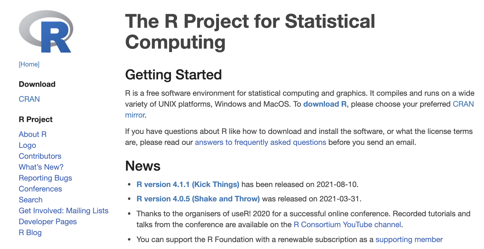
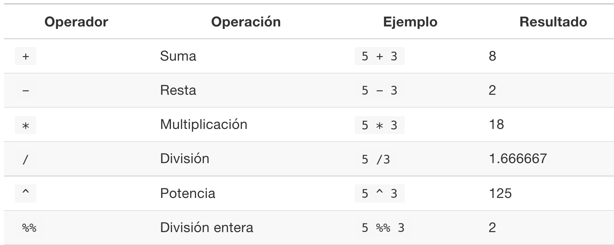
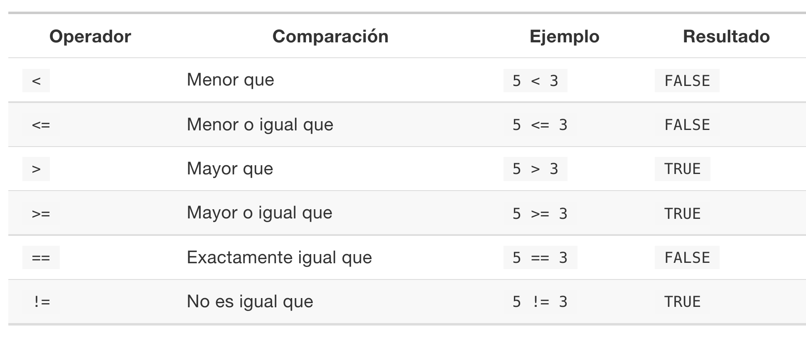
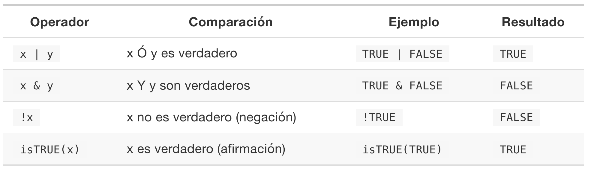
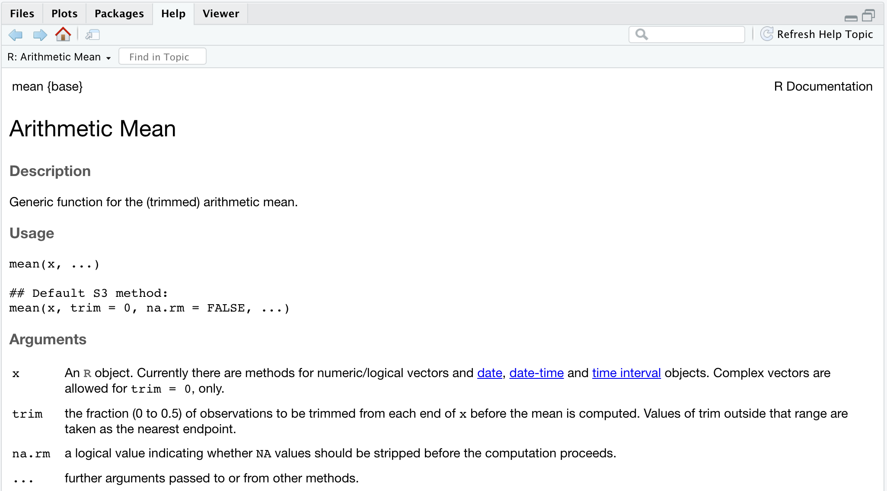
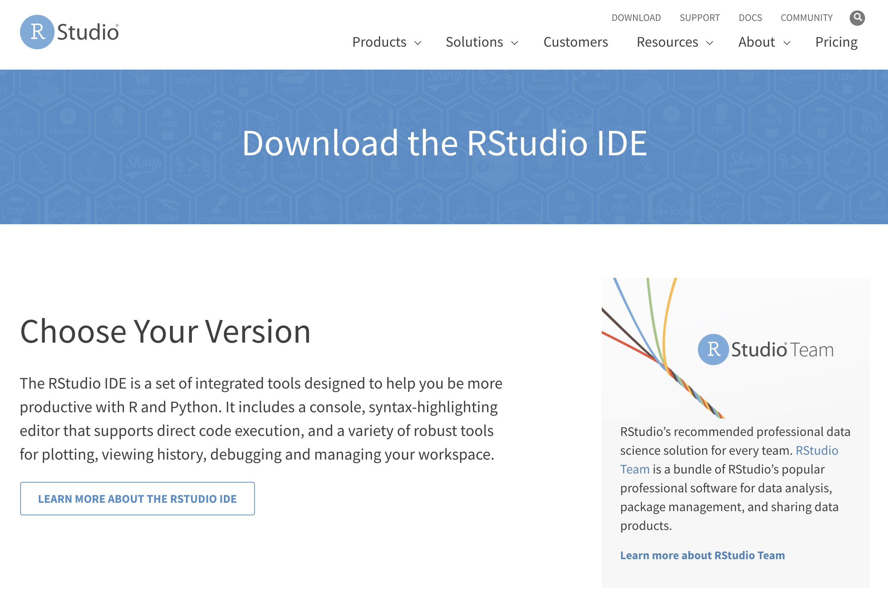
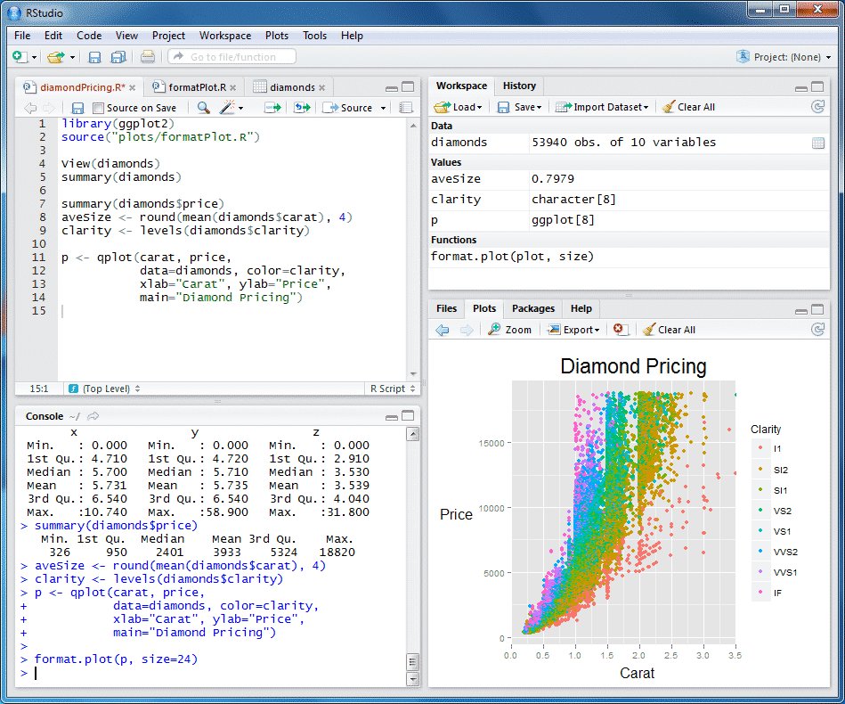

# Introducción {#intro}

El análisis de datos es el pilar fundamental de *Data Analytics* y *Data Science*. Por supuesto, el uso herramientas computacionales es importante. A lo largo de este materal usaremos el [`R`](https://www.r-project.org/), pero muchos de los conceptos aquí expuestos pueden trabajarse, sin problema, en otro lenguaje como [`Python`](https://www.python.org/) o [`Julia`](https://julialang.org/).

En la [Universidad del Norte](https://www.uninorte.edu.co/), los estudiantes tienen la posibilidad de tomar, a nivel de pregrado, cursos de Análisis de Datos. Parcticularmente, los estudiantes de la [División de Ingenierías](https://www.uninorte.edu.co/web/ingenierias) pueden tomar los cursos de :

1.  *Análisis de Datos en Ingeniería I*, ofrecido por el Departamento de [Ingeniería Industrial](https://www.uninorte.edu.co/web/departamento-de-ingenieria-industrial/);
2.  *Análisis de Datos en Ingeniería II*, ofrecido por el Departamento de [Ingeniería Industrial](https://www.uninorte.edu.co/web/departamento-de-ingenieria-industrial/);
3.  *Machine Learning*, ofrecido por el [Departamento de Ingeniería Eléctrica y Electrónica](https://www.uninorte.edu.co/web/departamento-de-ingenieria-electrica-y-electronica) y
4.  *Analítica de Datos Avanzada*; ofrecido por el Departamento de [Ingeniería Industrial](https://www.uninorte.edu.co/web/departamento-de-ingenieria-industrial/).

Estos cursos, cuya dificultad aumenta conforme a la enumeración anterior, permiten a los estudiantes de la División de Ingenierías tener herramientas básicas, intermedias y avanzadoas para convertir *datos* en *información*.

<!-- El curso de _Análisis de Datos en Ingeniería I_ introduce los conceptos básicos de analítica descriptiva, algunos elementos de probabilidad, el concepto de variables aleatorias, las distribuciones de probabilidad más utilizadas, así como pruebas de bondad de ajuste, procedimientos de pruebas de hipótesis y el modelo de Regresión Lineal Simple. -->

## Analítica de Datos

### Conceptos básicos

### Gráficos básicos

### Tópicos avanzados


## `R`

`R` es un entorno de programación *multiplataforma* y un lenguaje de programación [orientado a objetos](https://es.wikipedia.org/wiki/Programaci%C3%B3n_orientada_a_objetos) similar a [`S`](https://en.wikipedia.org/wiki/S_(programming_language)), pero bajo licencia [GNU](https://www.gnu.org/home.en.html), para el análisis gráfico y estadístico de datos creado en por [Robert Gentleman](https://www.linkedin.com/in/robert-gentleman-06845098) y [Ross Ihaka](https://www.stat.auckland.ac.nz/~ihaka/) en Agosto de 1993. La página oficial de `R` es [https://www.r-project.org/](https://www.r-project.org/). 

```{r logoR, echo=FALSE, out.width="25%", fig.cap="Logo oficial del `R`.", fig.align='center'}

```

Por ser multiplataforma, `R` puede utilizarse en diferentes sistemas operativos, incluyendo Windows, macos y varias distribuciones de Linux.


```{r whatsR, echo=FALSE, out.width="80%", fig.cap="Qué es `R`? Ver https://www.youtube.com/watch?v=XcBLEVknqvY.", fig.align='center'}

```

Desde su concepción y gracias a su constante evolución, 
`R` proporciona una gran cantidad de métodos estadísticos y gráficos, y es altamente extendible. Esta última característica permite el desarrollo e implementación de *nuevos* métodos estadísticos y *nuevos* tipos de gráficos, además de la automatización de reportes con relativa facilidad.

<!-- {width=50%} -->


### Por qué `R`?


### `CRAN`

`CRAN` es el acrónimo de `C`omprehensive, `R`, `A`rchive, `N`etwork, y corresponde a una red de servidores ftp y web de todo el mundo que almacenan versiones idénticas y actualizadas de código y documentación para `R`.  

El sitio web oficial es https://cran.r-project.org/

### Descarga e instalación

A Septiembre de 2021, la versión más reciente de `R`  es la 4.1.1, también denominada "Kick Things". 

```{r downloadR, echo=FALSE, out.width="95%", fig.cap="Página oficial del `R`. Note que la  versión más reciente es la 4.1.1.", fig.align='center'}

```

Dependiendo del sistema operativo, `R` puede descargarse en los siguientes enlances:

* [Windows](https://cran.r-project.org/bin/windows/base/). 
* [macos](https://cran.r-project.org/bin/macosx/). 
* Varias distribuciones de [Linux](https://cran.r-project.org/bin/linux/). 

Las versiones de `R` tienen un ciclo de actualización cada 6 meses, y  es altamente recomendable tener instalada la última versión del programa en el computador.  

Una vez descargado el instalador, basta con seguir las instrucciones para instalar el programa con las opciones por defecto. 


### Paquetes 

Los paquetes o _packages_ son colecciones de funciones y/o datos que ayudan a potencializar las funcionalidades de `R`.  Cada paquete tiene su documentación y, en muchos casos, ejemplos concretos que permiten comenzar a utilizarlos de inmediato.


```{r packages, echo=FALSE, out.width="80%", fig.cap="Algnos paquetes de `R`.", fig.align='center'}
knitr::include_graphics("images/rpackages.png")
```

```{r echo=FALSE, message=FALSE}
## R packages
paquetes <- scan('https://cran.r-project.org/web/packages/', what = 'character', quiet = TRUE)
```

Existen paquetes para visualización, minería de texto, automatización de reportes y mucho más. La lista completa de paquetes se encuentra [aquí](https://cran.r-project.org/web/packages/available_packages_by_name.html). A la fecha existen `r paquetes[43]` paquetes; algunos ejemplos conocidos son `MASS`, `ggplot2`, `shiny`, y `caret`, entre otros.

Para utilizar un paquete, debemos seguir dos pasos

1. Instalar el paquete; y
2. cargarlo a la sesión de trabajo.

La instalación de los paquetes se realiza utilizando la función `install.packages('PackageName')`, donde el argumento `PackageName` corresponde al _nombre_ del paquete que quiere instalarse. Por ejemplo, si quisiéramos instalar el paquete `DescTools`, escribimos:

```{r, eval=FALSE}
## instalación del paquete DescTools
install.packages('DescTools', dependencies = TRUE)
```

Posteriormente, aparecerán algunos mensajes que nos indican el progreso de dicha instalación. 

Cuando el proceso concluya, procedemos _cargar_ el paquete a la sesión de trabajo.  Para ello, utilizamos la función `library('PackageName')`. En nuestro caso, reemplazamos el argumento `PackageName` por el nombre del paquete que quieres utilizar:

```{r, eval=FALSE}
## carga del paquete DescTools en la sesión de trabajo
library('DescTools')
```

Con esta instrucción, `R` importa las funciones contenidas en el paquete `DescTools` a la sesión de trabajo actual.

```{block2, type='rmdwarning'}
La instrucción `install.packages('PackageName')` sólo debe ejecutarse _una vez_. Sin embargo, es necesario ejecutar `library('PackageName')` cada que inicies una sesión en `R`. Esto se debe a que aunque hayas instalado las funciones de un paquete con anterioridad, las sesiones de `R` se inician sólo con los objetos y funciones de base.
```

### Operadores básicos

#### Operadores aritméticos{-}

```{r operadores, echo=FALSE, out.width="95%", fig.cap="Operadores artiméticos en `R`. Tomado de [R para principantes](https://bookdown.org/jboscomendoza/r-principiantes4/operadores-aritmeticos.html).", fig.align='center'}

```

#### Operadores relacionales{-}

```{r relacionales, echo=FALSE, out.width="95%", fig.cap="Operadores relacionales en `R`. Tomado de [R para principantes](https://bookdown.org/jboscomendoza/r-principiantes4/operadores-relacionales.html).", fig.align='center'}

```

#### Operadores lógicos{-}

```{r logicos, echo=FALSE, out.width="95%", fig.cap="Operadores lógicos en `R`. Tomado de [R para principantes](https://bookdown.org/jboscomendoza/r-principiantes4/operadores-logicos.html).", fig.align='center'}

```

### Creación de funciones

Una de las grandes ventajas de `R` es la posibilidad de construir y/o agregar funciones propias. Como se mencionó anteriormente, los paquetes están conformados por funciones, además de datos. 

Una función es un conjunto de instrucciones organizadas para realizar una tarea específica y corresponde a un objeto que el intérprete de `R` es capaz de entender y utilizar sus argumentos para completar una acción. 

Algunas funciones disponibles _por defecto_ en `R` son

  ```{r, eval = FALSE}
  ## funciones R por defecto
  sqrt()
  mean()
  summary()
  rowSums()
  colSums()
  ```

La estructura de una función es 

```{r fns, echo=FALSE, out.width="70%", fig.cap="Estructura de una funcíon en `R`. Tomado de [_Learn by_ <_example_>](https://www.learnbyexample.org/r-functions/).", fig.align='center'}
knitr::include_graphics("images/Rfunctions.png")
```

lo cual implica que toda función, como mínimo, cuatro componentes:

1. `name`: Corresponde al nombre de la función. Se recomienda usar guión bajo o nombres con tipografía _camello_ para nombrarlas, es decir, `calcula_media` y `GraficoHist`. Bajo ninguna circunstancia deben usarse nombres como `coeficiente-variacion`.
2. `args`: Este componente de la función hace referencia a los _argumentos_ de esta. Por _argumentos_ denominamos a las entradas que requiere la función para hacer su trabajo. Una función puede tener varios argumentos; por ejemplo la función `t.test` tiene los argumentos `x`, `y`, `alternative`, `mu`, `paired`, `var.equal`, y `conf.level`. Algunas veces los argumentos tienen valores _por defecto_. De esta forma, cuando se utiliza la función, no es necesario especificar el valor de dicho argumento. Por ejemplo, en la función `mean`, el argumento `trim = 0`. 
3. `function body`: Contiene los pasos, procedimientos y cálculos que deben hacerse para producir un resultado.
4. `value`: Este es el _resultado_ de la función. Dependiendo de qué tan compleja sea la función, el `value` puede ser un escalar, un `data.frame`, una lista, un archivo de texto o un gráfico. Hay muchas posibilidades.


**Ejemplo**

Como ilustración, construyamos una función que, dado un vector de datos de cualquier longitud, calcule el [coeficiente de variación](https://es.wikipedia.org/wiki/Coeficiente_de_variaci%C3%B3n) (CV). 

El CV está definido como

$$CV = \frac{s}{\bar{x}}$$
donde $s$ es la desviación estándar y $\bar{x}$ es la media muestral.

Si el vector de datos es 

```{r}
## datos
v <- c(3, 2, 3, 4, 5, 4, 5, 5, 4, 2, 9, 8) 
```

entonces nuestra función, que llamaremos `CoefVar`, debe tener como argumento dicho vector. Internamente, `CoefVar` debe calcular la desviación estándar y la media muestral de `v`. Por lo tanto, 


```{r}
## cálculo del coeficiente de variación
## v es un vector numérico
CoefVar <- function(v){
   ## cálculos
   m <- mean(v)      ## media
   s <- sd(v)        ## s
   resultado <- s/m  ## CV
  
  ## output
  return(resultado)
}
```

Ahora, para usar nuestra función `CoefVar` con el vector `v` hacemos

```{r}
## cálculo del CV
CoefVar(v)
```

Teniendo el valor del CV, podríamos determinar si la media muestral es una cantidad representativa del conjunto de datos. Para ello comparamos el resultado de $100\times$`CoefVar` con 30%. 

```{r}
## función para determinar si la media representativa
representativa <- function(v, cutoff = 30){
  CV_p <- 100*CoefVar(v)
  decision <- ifelse(CV_p > cutoff, 'no', 'si')
  list(CV_p = CV_p, decision = decision)
}
```

Observe que en esta función incluimos un argumento denominado `cutoff`. Por defecto, `cutoff = 30`. Además. la eultima línea de la función comienza con `list`, lo cual implica que el resultado de la función será una lista de dos componentes: `CV_p` y `decision`.

Veamos qué ocurre con el vector `v` utilizando los valores por defecto:

```{r}
## aplicación de la función representativa
representativa(v)
```

Por lo tanto, el CV del vector `v` es `r round(CoefVar(v), 3)`. Como $100\times$`CVp`$>30$, la decisión es que la media `no` es representativa de los datos.

Si queremos cambiar el argumento `cutoff` basta con hacer

```{r}
## representatividad con cutoff = 50
representativa(v, cutoff = 50)
```
Observe que `decision` es diferente esta vez. Si queremos extraer el _segundo_ elemento del resultado obtenido con la función `representativa`, debemos asignar dicho resultado a un objeto y posteriormente operar sobre él de la siguiente manera:

```{r}
## extrayendo la decisión
decision <- representativa(v, cutoff = 50)
decision[[2]]
```


### Obteniendo ayuda

Hay múltiples formas de acceder a la ayuda cuando trabajamos con `R`. En https://www.r-project.org/help.html se encuentra una descripción de cómo hacerlo.

Podemos buscar ayuda, principalmente, a través de la consola del `R` utilizando los siguientes mecanismos:

1. `help` y `?`. Si requerimos ayuda sobre la función `mean`, podemos escribir `?mean` o `help(mean)` en la consola del `R`. El resultado será:

```{r help, echo=FALSE, out.width="90%", fig.cap="Resultado de escribir `?mean` en la consola del `R`.", fig.align='center'}

```

2. `apropos('word')`. Esta función en `R` permite encontrar _todas_ las funciones del espacio de tabajo que contienen la palabra `word`. Por ejemplo, `apropos('mean')` produce

```{r, echo=FALSE}
## funciones que contienen 'mean'
apropos('mean')
```
Si queremos saber qué hace `rowMeans` o cuáles son sus argumentos, basta con escribir `?rowMeans` o `help(rowMeans)` en la consola.

3. `RSiteSearch()`. Esta función busca información en las páginas de ayuda de las todas las funciones y en las viñetas de todos los paquetes de `CRAN`, así como en [`CRAN Task Views`](https://cran.r-project.org/web/views/).

4. R FAQs. Hay tres listas principales de preguntas frecuentes (FAQs) que se actualizan periódicamente para reflejar las preguntas más frecuentes de los usuarios de `R`: [`R Main FAQs`](https://cran.r-project.org/doc/FAQ/R-FAQ.html), [`R FAQs para Windows`](https://cran.r-project.org/bin/windows/base/rw-FAQ.html) y [`R FAQs para macos`](https://cran.r-project.org/bin/macosx/RMacOSX-FAQ.html)

5. Stack overflow. Este es un sitio bien organizado para ayuda y discusiones sobre programación. Para acceder directamente a las discusiones relacionadas con `R`, se recomienda visitar https://stackoverflow.com/questions/tagged/r

6. [R-help-es](https://stat.ethz.ch/mailman/listinfo/r-help-es). Esta es una lista de correo, creada en 2009, para solicitar ayuda sobre `R` en español y se entiende como un complemento social a la documentación, libros, etc. disponibles sobre `R`. Puede acceder directamente a los archivos en https://stat.ethz.ch/pipermail/r-help-es/


### Lectura de datos

Los datos se almacenan de múltiples formas. Los formatos más comunes son 

1. Archivos de texto cuya extensión es `.txt`; 
2. hojas de cálculo de Excel, cuya extensión es `.xls` o `.xlsx`;
3. archivos separados por coma, cuya extensión es `.csv`;
4. archivos con extensión `.dat`;
5. archivos con extensión `.sav` provenientes de  [SPSS](https://es.wikipedia.org/wiki/SPSS); y 
6. archivos disponibles en Google Drive o Dropbox.

En `R` existen diferentes funciones que permiten leer _casi_ cualquier tipo de datos. Algunas funciones clave son
  
  ```{r, eval = FALSE}
  scan()
  read.table()
  read.csv()
  readLines()
  read.xls()  # del paquete gdata
  fread()     # del paquete data.table
  ```

Algunos ejemplos adicionales pueden encontrarse en el Capítulo8 del [Manual de R](https://fhernanb.github.io/Manual-de-R/read.html), o en el Capítulo 11 de [R for Data Science](https://es.r4ds.hadley.nz/importaci%C3%B3n-de-datos.html).

```{block2, type='rmdtip'}
Se sugiere al lector consultar la ayuda de las funciones anteriores.
```


Por ejemplo, si tenemos el URL https://bit.ly/2RmO1OR donde se encuentran almacenados unos datos, podemos utilizar la función `read.table` para leerlos en `R`:


```{r}
## lectura de datos desde un URL
url <- "https://bit.ly/2RmO1OR" 
d <- read.table(url, header = TRUE)

## primeras 10 filas
head(d, 10)
```

Ahora, utilizar los datos contenidos en el objeto `d` podemos aplicar diferentes técnicas de Analítica de Datos para extrer información. Por ejemplo, podemos construir un diagrama de dispersión para explorar la relación que existe entre las variables `Resistencia` y `Edad`:

```{r, cache=TRUE, fig.height=5, fig.width=5, fig.cap='Diagrama de dispersión y densidades para `Resistencia` vs. `Edad`.', fig.align='center'}
## paquetes
library(ggplot2)
library(ggExtra)
 
## gráfico
p <- ggplot(d, aes(x = Edad, y= Resistencia)) +
      geom_point() +
      theme(legend.position="none") + theme_minimal()
ggMarginal(p, type="density")
```


## RStudio

[RStudio](https://www.rstudio.com/) es un entorno de desarrollo integrado (IDE) para `R` disponible en ediciones comerciales y de código abierto y se ejecuta en el escritorio (Windows, macos y Linux).


```{r RStudioLogo, echo=FALSE, out.width="50%", fig.cap="Página oficial del `R`. Note que la  versión más reciente es la 4.1.1.", fig.align='center'}
knitr::include_graphics("images/RStudiologo.png")
```


RStudio incluye una consola, un editor que resalta la sintaxis y admite la ejecución directa del código, así como herramientas para el trazado, el historial, la depuración y la gestión del espacio de trabajo.

Para descargar Rstudio, basta con visitar la [página](https://www.rstudio.com/products/rstudio/download/) oficial. Una vez allí, basta escoger la versión acorde con nuestro sistema operativo, preferiblemente gratuita.

```{r downloadRStudio, echo=FALSE, out.width="95%", fig.cap="Página de descarga de RStudio.", fig.align='center', eval=FALSE, echo=FALSE}

```

Una vez descargado, es suficiente con abrir el instalador y seguir las instrucciones. Cuando el proceso termine, el siguiente paso es abrirl el programa haciendo _click_ en el ícono de RStudio y vse abrirá una ventana similar a esto:


```{r RStudioIDE, echo=FALSE, out.width="85%", fig.cap="RStudio IDE. Tomado de [Diego Calvo](https://www.diegocalvo.es/definicion-de-rstudio/rstudio-ejemplo-de-paneles/).", fig.align='center'}

```

Por ser un [IDE](https://es.wikipedia.org/wiki/Entorno_de_desarrollo_integrado), RStudio está compuesto por cuatro paneles:

* `Panel 1`. Está ubicado en la esquina superior _izquierda_. En este panel se escriben los _scripts_, los cuales corresponde a instrucciones que `R` puede leer y ejecutar.
* `Panel 2`. Está ubicado en la parte superior _derecha_. Este panel está compuesto, principalmente, por dos pestañas:  `Workspace` y `History`. La pestaña `Workspace` muestra los objetos y funciones creados dutante la sesión de trabajo.
* `Panel 3`. Este panel, ubicado en la esquina inferior _derecha_, está compuesto por varias pestañas, incuyendo `Files`, `Plots`, `Packages` y `Help`. La pestaña `Files` muestra los archivos presentes en el directorio de trabajo; `Plots` muestra los diferentes gráficos que se crean en la sesión; `Packages` muestra los diferentes paquetes instalados en `R` y aquellos en uso durante la sesión de trabajo; y, finalmente, `Help` nos muestra la ayuda de funciones y/o paquetes.
* `Panel 4`. Este panel, ubicado en la esquina inferior _izquierda_, corresponde a la consola del `R`. En este panel todas las instrucciones o _scripts_ son interpretadas y ejecutadas por el programa.

```{block2, type='rmdnote'}
Es posible modificar la organización del RStudio IDE. Para ello, basta con ingresar a `Tools` --> `Global Options...` --> `Pane Layout`.
```


<!-- ## Cursos *online* -->

