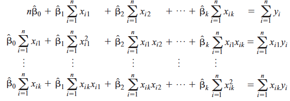
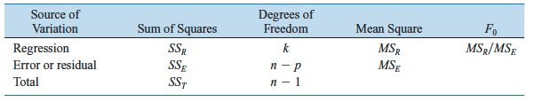

# Regresión Lineal Múltiple{#rlm}
Como se mencionó en el Capítulo [2](#rls), los modelos de regresión lineal pueden utilizarse para predecir futuros valores de una variable respuesta continua a partir de valores *específicos* de las variables *controlables* del proceso. 

En la práctica, pueden existir múltiples variables controlables en un proceso de producción o de servicios. Por ejemplo, en un proceso de pintura electrostática, puede ser de interés determinar el espesor de la capa de pintura (variable respuesta $y$, en micrones) con la que se recubre una lámina de área determinada, a partir de valores conocidos de la presión de aire (variable $x_1$ en *psi*) y la velocidad de la banda transportadora (variable $x_2$  en m/s) en la que se desplaza dicha lámina.  En este caso, el interés es:

1. Determinar la _magnitud de la influencia_ de las variables $x_1$ y $x_2$ sobre el espesor de capa esperado;
2. construir una función $f(x_1,x_2)$ que permita predecir el espesor de capa esperado; y 
3. construir intervalos de confianza y predicción para dicho valor.

Si la variable respuesta $y$ es continua y aproximadamente simétrica, podemos desarrollar 1, 2 y 3 a partir de la estimación de un modelo de regresión lineal. Puesto que el número de variables controlables es $k>1$,  una posibilidad es utilizar el modelo de Regresión Lineal Múltiple (RLM). 

```{block2, type='rmdnote'}
El modelo de RLM es una _extensión_ del modelo de RLS cuando se tiene más de una variable controlable.
```


## Formulación básica del modelo de RLM
Matemáticamente, el modelo de RLM puede expresarse como:

\begin{align} \label{mod1}
y_i &= \beta_0 + \beta_1X_{1i} + \beta_2X_{2i} + \cdots + \beta_1X_{ki} + \epsilon_i,\\ 
\epsilon_i &\sim N(0, \sigma^2), \\
\sigma^2 &= \text{constante}.
\end{align}

Este modelo es equivalente a

\begin{align} \label{mod2}
\mathbf{y} &= \mathbf{X}\mathbf{\beta} + \mathbf{\epsilon}
\end{align}

donde $\mathbf{y} = (y_1,y_2,\ldots,y_n)$ es el vector respuesta, $\mathbf{X} = (\mathbf{1}, \mathbf{x}_1, \mathbf{x}_2,\ldots,\mathbf{x}_k)_{n\times p}$ es la matriz de diseño y $\mathbf{\epsilon} = (\epsilon_1,\epsilon_2,\ldots,\epsilon_n)$ es el error aleatorio. 


### Estimación{#estimacion}
Similar a RLS, la estimación del modelo de RLM se realiza utilizando el método de mínimos cuadrados ordinarios (MCO).

A partir de una muestra aleatoria de tamaño $n$ del proceso de producción, los datos se registran en una estructura rectangular similar a:

```{r str, echo=FALSE, out.width="40%", fig.cap="Estructura de datos en RLM.", fig.align='center'}
knitr::include_graphics("images/datastructure.png")
```

De esta forma, se tienen $n$ unidades experimentales para cada una de estas se determina el valor de la variable respuesta $y_i$ para condiciones fijas $\mathbf{X}_i$. Por ejemplo, para la quinta unidad experimental, se obtuvo el valor $y_6$ cuando  las variables controlables tomaron los valores fijos $(x_{1,6}, x_{2,6}, \ldots, x_{k,6})$.


Al igual que en RLS, la estimación del modelo de RLM realiza utilizando minimos cuadrados La idea fundamental consiste en minimizar

\begin{eqnarray*}\label{L}
L &=&\sum_{i=1}^n\epsilon_i^2 = \sum_{i=1}^n(Y_i-\beta_0-\beta_1X_{1,i} -\beta_2X_{2,i} - \ldots -\beta_kX_{k,i} )^2.
\end{eqnarray*}

Los estimadores de mínimos cuadrados deben satisfacer las siguientes dos condiciones fundamentales:

\begin{eqnarray*}
  \frac{\partial L}{\partial \beta_0} | _{\hat{\beta}_0,\hat{\beta}_1,\ldots \hat{\beta}_k} &=& -2\sum_{i=1}^n \left(y_i-\hat{\beta}_0-\sum_{j=1}^k{\hat{\beta}_jx_{ij}}\right) = 0   \\ 
  \frac{\partial L}{\partial \beta_j} | _{\hat{\beta}_0,\hat{\beta}_1,\ldots \hat{\beta}_k} &=& -2\sum_{i=1}^n \left(y_i-\hat{\beta}_0-\sum_{j=1}^k{\hat{\beta}_jx_{ij}}\right)x_{ij} = 0 
  \end{eqnarray*}
  
La solución al sistema de ecuaciones de condiciones fundamentales da origen al sistema de ecuaciones normales de mínimos cuadrados dado por

```{r ecuaciones, echo=FALSE, out.width="70%", fig.cap="Ecuaciones normales de mínimos cuadrados.", fig.align='center'}

```

  
Las solución de estas ecuaciones permite determinar $\hat{\mathbf{\beta}}$. Es fácil llegar a que el vector de coeficientes estimado para el modelo de RLM puede obtenerse como

$$
\hat{\mathbf{\beta}} = (\mathbf{X}^\prime\mathbf{X})^{-1}\mathbf{X}^\prime \mathbf{y}
$$
<!-- donde $\mathbf{X}$ es la matriz de diseño. -->


Finalmente, el modelo estimado es $$\hat{y}_i =  \hat{\beta}_0+\sum_{j=1}^k\hat{\beta}_jx_{ij},$$ 

que, matricialmente, puede representarse como 

$$\hat{\mathbf{y}} =  \mathbf{X}\hat{\mathbf{\beta}}$$

A partir del modelo ajustado, un valor específico $y_i$ puede calculase como:

$$\hat{y}_i =  \hat{\beta}_0 + \hat{\beta}_1x_1 + \hat{\beta}_2x_2+\cdots+\hat{\beta}_kx_k$$

Como ilustración, consideremos los siguientes datos provenientes de un proceso de pintura electrostática:

```{r}
## lectura de datos
url <- 'https://www.dropbox.com/s/st5xk1prkxg1pj4/datalab2.txt?dl=1'
datos <- read.table(url, header = TRUE)
head(datos)
```

En este caso, la variable respuesta $y$ representa el espesor de la capa de pintura en micrones, $x_1$ es la presión de aire en _psi_ y $x_2$ es la velocidad de la banda transportadora.

Una forma de comenzar a establecer si existe relación lineal entre $y$ y las variables $x_1$ y $x_2$ es a través de una red, como se muestra a continuación:

```{r eval=TRUE, tidy=TRUE, size = 'normalsize', cache=FALSE, message=FALSE, cache=TRUE, fig.width=5, fig.height=5, fig.align='center', fig.cap='Red de correlación para $x_1$, $x_2$ y $y$. Correlaciones positivas se muestran en verde, y las negativas en rojo.'}
## matriz de correlación
require(IsingSampler)
require(qgraph)
corMat <- cor(datos)
par(mfrow = c(1,1), mar = c(.1, .1, .1, .1))
qgraph(corMat, graph = "cor", layout = "spring", 
       sampleSize = nrow(datos), 
       legend.cex = 1, alpha = 0.05)
```

O utilizando una matriz de dispersión:

```{r eval=TRUE, tidy=TRUE, size = 'normalsize', cache=FALSE, message=FALSE, cache=TRUE, fig.width=5.5, fig.height=5.5, fig.align='center', fig.cap='Matriz de dispersión para $x_1$, $x_2$ y $y$.'}
## pairs plot
panel.cor <- function(x, y, digits = 2, prefix = "", cex.cor, ...)
{
    usr <- par("usr"); on.exit(par(usr))
    par(usr = c(0, 1, 0, 1))
    r <- cor(x, y)
    txt <- format(c(r, 0.123456789), digits = digits)[1]
    txt <- paste0(prefix, txt)
    text(0.5, 0.5, txt, cex = 1.5)
}
pairs(datos, lower.panel = panel.smooth, upper.panel = panel.cor, las= 1)
```

Este último gráfico indica que $x_1$ e $y$ están linealmente relacionados y la correlación es $\hat\rho = 0.89$, mientras la correlación de $y$ y $x_2$ es $\hat\rho = -0.32$.

```{block2, type='rmdtip'}
Para otras posibilidades relacionadas con correlogramas, se recomienda revisar las alternativas en [R Graph Gallery](https://www.r-graph-gallery.com/correlogram.html).
```

Para estimar el modelo de RLM, utilizamos la función `lm` como se muestra a continuación:

```{r eval=TRUE, tidy=TRUE, size = 'normalsize', cache=FALSE, message=FALSE, cache=FALSE}
## ajuste del modelo de RLM
fit <- lm(y ~ x1 + x2, data = datos)
summary(fit)
```

A partir de estos resultados podemos realizar las pruebas de significancia global y marginales tal y como se mostró en el Capítulo \@ref(rls). 


## Propiedades de los estimadores de ${\mathbf{\beta}}$

Cuando estimamos $\hat{\mathbf{\beta}}$, los cálculos están basados en los resultados obtenidos al tomar una muestra aleatoria de tamaño $n$. Como consecuencia, el valor de los estimadores $\mathbf{\hat{\beta}} = (\hat{\beta}_0, \hat{\beta}_1, \ldots, \hat{\beta}_k)$ cambian si cambiamos la muestra.

Desde el punto de vista formal, los estimadores $\mathbf{\hat{\beta}}$ cumplen con las siguientes propiedades:

1. Los estimadores $\mathbf{\hat\beta}$ son insesgados. Esta propiedad implica que, al aumentar $n$, el valor de los estimadores de $\mathbf{\beta}$ se aproximan a los verdaderos valores de los parámetros. Matemáticamente se tiene que:

\begin{eqnarray}
E[\mathbf{\hat\beta}] &=& E[(\mathbf{X}^\prime\mathbf{X})^{-1}\mathbf{X}^\prime\mathbf{y}]\\\nonumber
                  &=& E[(\mathbf{X}^\prime\mathbf{X})^{-1}\mathbf{X}^\prime(\mathbf{X\beta} + \mathbf{\epsilon})]\\\nonumber
                  &=& E[(\mathbf{X}^\prime\mathbf{X})^{-1}\mathbf{X}^\prime\mathbf{X\beta} + (\mathbf{X}^\prime\mathbf{X})^{-1}\mathbf{X}^\prime\mathbf{\epsilon}]\\\nonumber
                  &=& E[(\mathbf{X}^\prime\mathbf{X})^{-1}\mathbf{X}^\prime\mathbf{X\beta}] + E[(\mathbf{X}^\prime\mathbf{X})^{-1}\mathbf{X}^\prime\mathbf{\epsilon}]\\\nonumber
                  &=& E[\mathbf\beta] + \mathbf{0} = \mathbf{\beta}\nonumber
\end{eqnarray}


2. La varianza de $\hat{\beta}_j$ y la covarianza entre $\hat\beta_{i}$ y $\hat\beta_{j}$ están dadas por:

\begin{eqnarray*}
V(\hat\beta_{j}) &=& \sigma^2(\mathbf{X}^\prime\mathbf{X})^{-1}_{jj} \hspace{0.5cm} 0,1,2,\ldots,p;\\
\text{cov}(\hat\beta_{i}, \hat\beta_{j}) &=& \sigma^2(\mathbf{X}^\prime\mathbf{X})^{-1}_{ij} \hspace{0.5cm} i\neq j.
\end{eqnarray*}


Ahora, a partir de $E[\hat{\beta}_j]$ y $V(\hat\beta_{j})$, es posible hacer **inferencia** para el parámetro $\beta_j$, $j=1,2,\ldots,k.$ Sin embargo, observe que $V(\hat\beta_{j})$ depende de $\sigma^2$, la varianza del modelo de RLM, que se estima a través del MSE.

Los coeficientes del modelo de RLM ajustado para los datos provenientes del proceso de pintura electrostática se obtienen haciendo:

```{r}
## coeficientes estimados
coefficients(fit)
```

A partir de estos coeficientes, el modelo ajustado será

$$\hat{y} = 66.285 + 1.483x_1 - 1.055x_2$$
Note que esta es la ecuación de un plano en el espacio $(x_1, x_2, y)$.

```{block2, type='rmdnote'}
Los coeficientes _estimados_ del modelo de RLM se interpretan en términos de una _derivada_ parcial.
```

En particular, si incrementamos $x_1$ en una unidad y mantenemos _constante_ $x_2$, esperaríamos que el espesor de la capa de pintura aumentara, en promedio, $\hat{\beta}_1 = 1.483$ micrones. Por otro lado, si incrementamos $x_2$ en una unidad y mantenemos _constante_ $x_1$, se espera que el espesor de la capa de pintura disminuya, en promedio, $\hat{\beta}_2 = -1.055$  micrones.

## Estimación de $\sigma^2$
 

Similar a como se observó en RLS, en RLM, también se cumple la misma relación que en RLS en cuanto que 

$$SST = SSR + SSE $$

Adicionalmente, $\mathbf{\hat{\beta}}$, se tiene que

\begin{eqnarray*}\label{L2}
L &=&\sum_{i=1}^n\hat{\epsilon}_i^2 = \sum_{i=1}^n(Y_i-\hat{Y}_i^2)^2  \\
  &=&\sum_{i=1}^n(Y_i-\hat{\beta}_0-\hat{\beta}_1X_{1,i} -\hat{\beta}_2X_{2,i} - \cdots -\hat{\beta}_kX_{k,i})^2 \\
  &=& SSE
\end{eqnarray*}

Por lo tanto,

$$\hat{\sigma}^2 = \frac{SSE}{n-p} = MSE$$

donde $p = k+1$ es el número de coeficientes del modelo ajustado.

Este resulado indica que la varianza de los errores, también conocida como la **varianza del modelo**, puede estimarse utilizando el MSE. El MSE se obtiene de la tabla ANOVA que tiene la siguiente forma:
  
  
```{r tablaanova, echo=FALSE, out.width="90%", fig.cap="Tabla ANOVA en RLM.", fig.align='center'}

```

En el caso del modelo de RLM para el proceso de pintura electrostática, podemos obtener el valor de $\hat{\sigma}^2$ haciendo:

```{r sigma}
## estimación de sigma^2
summary(fit)$sigma^2
```
Por lo tanto, el modelo estimado será:

$$
\begin{eqnarray} 
\hat{y} &=& 66.285 + 1.483x_1 - 1.055x_2 \\\nonumber
\epsilon &\sim& N(0, \sigma^2) \\\nonumber
\hat{\sigma}^2 &=& 7.655.\nonumber
\end{eqnarray}
$$

  <!-- donde    -->

  <!-- \begin{eqnarray} -->
  <!-- SST = \sum_{i=1}^ny_i^2 - \frac{1}{n}\left(\sum_{i=1}^ny_i \right)^2, \hspace{1cm} SSE = \sum_{i=1}^n\hat{\epsilon}_i^2 \\\nonumber -->
  <!-- \end{eqnarray} -->
  
  Recordemos que, adicional al MSE, a partir de la tabla ANOVA es posible calcular el porcentaje de variabilidad de la respuesta explicado por el modelo de RLM, también conocido como **coeficiente de determinación** o, simplemente, como $R^2$:
  
  $$R^2 = SSR/SST = 1 - SSE/SST$$
  
  Puesto que $R^2$ incrementa a medida que el número de variables aumenta, se recomienda utilizar el $R^2$ ajustado en RLM:
  
  $$R^2_{\text{ajustado}} = 1 - \frac{SSE/(n-p)}{SST/(n-1)}$$

 La interpretación de esta medida de desempeño es similar a la interpretación de $R^2$ discutida en el Capítulo \@ref(rls).
 
 El ejemplo de la pintura electrostática,  $R^2_{\text{adj}}=0.8689$, por lo que podemos afirmar que incluir las variables $x_1$ y $x_2$ en un modelo de regresión permite explica cerca del 87% de la variabilidad de la respuesta. 


## Inferencia para $\mathbf{\beta}$

Uno de los propósitos de la **inferencia estadística** es determinar el valor de los verdaderos parámetros de una población a partir de los resultados obtenidos en una muestra. En este caso, los parámetros poblacionales son $\mathbf{{\beta}} = (\beta_0, \beta_1, \ldots, \beta_k)$, además de $\sigma^2$.

Con los valores muestrales, podemos construir pruebas de hipótesis de dos tipos para los parámetros del modelo de RLM: la prueba de significancia total y las pruebas de significancia marginal.


### Prueba de significancia global 
Esta prueba se utiliza para determinar la **significancia total** del modelo, es decir, para detemrinar si incluir las variables controlables en el modelo de regresión es mejor que no incluirlas para explicar la respuesta $Y$. La idea fundamental es determinar si, en la población, 

\begin{eqnarray}
  H_0&:& \beta_1=\beta_2=\cdots\beta_k=0 \\\nonumber
  H_1&:& \text{Al menos un $\beta_j \neq 0$}\nonumber
  \end{eqnarray}  

Este procedimiento de prueba de hipótesis se realiza a
través de la tabla de ANOVA utilizando el estadístico $F$ dado por

$$F_0 =  \frac{SSR/k}{SSE/(n-p)} = \frac{MSR}{MSE} \sim F_{k, n-p}$$
  
Rechazamos $H_0: \beta_1=\beta_2=\cdots\beta_k=0$ si $F_0 > F_{\alpha,k,n-p}$, donde $\alpha\in(0,1)$ es un nivel de significancia predeterminado. Cuando esto ocurre, concluimos que al menos un $\beta_j$ es estad\'isticamente significativo al $100(1-\alpha)\%$.

Observe que en la prueba de significancia global del modelo, $F_{\text{calc}} = 329.1$ y $p < 2.2\times 10^{-16}$. Esto indica que tener este modelo de RLM para explicar el espesor de la capa de pintura es mejor que no tenerlo.


### Prueba de significancia marginal 
Esta prueba se realiza si rechazamos la prueba de significancia global. Lo que intentamos hacer es determinar si, a nivel poblacional, los coeficientes asociados a cada $x_j$ son o diferentes de cero. Esto es equivalente a probar:

  \begin{eqnarray*}
  H_0&:& \beta_j=0 \\\nonumber
  H_1&:& \beta_j \neq 0\nonumber
  \end{eqnarray*}  
  
Para $j$ fijo, el estadístico de prueba es

$$t_j = \frac{\hat{\beta}_j - 0}{\text{s.e.}(\hat\beta_j)} = \frac{\hat{\beta}_j}{\sqrt{\hat{\sigma}^2(\mathbf{X}^\prime\mathbf{X})^{-1}_{jj}}}\sim t_{n-p}$$

Por lo tanto, rechazamos $H_0$ con un nivel de significancia de $100\times(1-\alpha)\%$ si $|t_j| > t_{\alpha/2, n-p}$. 

Para el problema de la pintura electrostática, tendríamos:

```{r eval=TRUE, tidy=TRUE, size = 'normalsize', cache=FALSE, message=FALSE, cache=FALSE}
## ajuste del modelo de RLM
summary(fit)$coefficients
```

Según estos resultados, todas las pruebas marginales del tipo $H_0: \beta_j = 0$ vs. $H_1: \beta_j \neq 0$, el valor $p$ es $< 0.05$. Por lo tanto, la magnitud de la influencia de cada variable controlable sobre $E[y|x_1, x_2]$ es estadísticamente diferente de cero a nivel poblacional. En otras palabras, controlando las variables $x_1$ y $x_2$ en el proceso, permitiría modificar satisfactoriamente el espesor de la capa de pintura. 


### Intervalos de confianza para $\beta_j$

Otra forma de realizar inferencia para $\mathbf{\beta}$ es a través de la construcción de intervalos de confianza del $100\times(1-\alpha)100\%$. Es fácil mostrar que, para $j$ fijo,
  
  \begin{equation}\label{eq:icbeta}
  \beta_j\in \left( \hat{\beta}_j - t_{\alpha/2, n-p} \sqrt{\hat{\sigma}^2(\mathbf{X}^\prime\mathbf{X})^{-1}_{jj}}, \hat{\beta}_j + t_{\alpha/2, n-p} \sqrt{\hat{\sigma}^2(\mathbf{X}^\prime\mathbf{X})^{-1}_{jj}} \right)
  \end{equation}
  
  Otra alternativa para construir intervalos de confianza es vía _bootstrap_ o _likelihood profiling_. Finalmente concluimos, con un nivel de confianza del $100\times(1-\alpha)\%$, que $\beta_j$ está en el intervalo anterior.
  
  Uan forma de construir los intervalos de confianza para los coeficientes del modelo es utilizando la función `confint.default`:
  
```{r}
## intervalos de confianza del 95% para los coeficientes
confint.default(fit)
```
Por lo tanto, con una confianza del 95%,

\begin{align}
\beta_0 &\in(64.12, 68.45) \\
\beta_1 &\in(1.36, 1.60) \\
\beta_2 &\in(-1.323, -0.787).
\end{align}


## Inferencia para $E[\mathbf{Y}|\mathbf{x}_0]$

```{block2, type='rmdwarning'}
El modelo de RLM ajustado puede utilizarse para predecir $E[\mathbf{Y}|\mathbf{x}_0]$ sólo si se validan **todos los supuestos**. Para más detalles ver [Análisis de Residuales](#residuales).
```


### Intervalos de confianza para $E[\mathbf{Y}|\mathbf{x}_0]$

A partir del modelo ajustado y para valores fijos de las variables controlables, digamos $\mathbf{x}_0$, se tiene que 
 \begin{eqnarray}
 \hat{\mu}_{\mathbf{Y} | \mathbf{x}_0} &=& \hat{E[\mathbf{Y} | \mathbf{x}_0]} = \mathbf{x}_0^\prime\hat{\mathbf{\beta}} \\\nonumber
 V[\hat{\mu}_{\mathbf{Y} | \mathbf{x}_0}] &=& \hat{\sigma}^2\mathbf{x}_0^\prime(\mathbf{X}^\prime\mathbf{X})^{-1}\mathbf{x}_0
 \end{eqnarray}

Finalmente, el intervalo de confianza del $100\times(1-\alpha)\%$ puede calcularse como

 \begin{eqnarray}
 \hat{\mu}_{\mathbf{Y} | \mathbf{x}_0} \pm t_{\alpha/2,n-p}\sqrt{\hat{\sigma}^2\mathbf{x}_0^\prime(\mathbf{X}^\prime\mathbf{X})^{-1}\mathbf{x}_0}
 \end{eqnarray}

Supongamos que queremos determinar el espesor de la capa de pintura para las condiciones $\mathbf{x}_0 = (10, 8)$, es decir, cuando $x_1 = 10$ y $x_2 = 8$. 

En `R` procedemos de la siguiente manera:

```{r}
## cálculo de E[y|x_1 = 10, x_2 = 8]
predict(fit, newdata = data.frame(x1 = 10, x2 = 8))
```
Si trabajamos bajo las condiciones $\mathbf{x}_0$, se espera que, en promedio, el espesor de la capa de pintura sea 72.67 micrones.

```{block2, type='rmdtip'}
Para otros argumentos y opciones, se sugiere al lector escribir 
`?predict.lm` en la consola de `R`.
```

Ahora, si es de interés calcular un intervalo de confianza del 95%, agregamos el argumento  `interval = 'confidence'` a la instrucción anterior:

```{r}
## cálculo de E[y|x_1 = 10, x_2 = 8]
predict(fit, newdata = data.frame(x1 = 10, x2 = 8), interval = 'confidence')
```
Por lo tanto, se espera que, si continuamos trabajando bajo las condiciones $x_1 = 10$ y $x_2 = 8$, el espesor de capa _promedio_ sea 72.67 micrones. A nivel _poblacional_,  dicho promedio se encontrará en el intervalo $(71.646, 73.695)$ con una confianza del 95%.


### Intervalos de predicción para $E[\mathbf{Y}|\mathbf{x}_0]$

Sea $\hat{y}_0 =  \hat{\mu}_{\mathbf{Y} | \mathbf{x}_0}$, donde $\mathbf{x}_0$ es el vector de covariables *futuro*.  Un intervalo de predicción del $100\times(1-\alpha)\%$ para $Y_0$ está dado por:

 \begin{eqnarray}
 \hat{y}_0 \pm t_{\alpha/2,n-p}\sqrt{\hat{\sigma}^2(1 + \mathbf{x}_0^\prime(\mathbf{X}^\prime\mathbf{X})^{-1}\mathbf{x}_0)}
 \end{eqnarray}
 
Otra posibilidad para construir dicho intervalo es vía [*bootstrap*](https://es.wikipedia.org/wiki/Bootstrapping_(estad%C3%ADstica)). Observe que lo único que cambia en este intervalo en relación con el intervalo de confianza es la varianza de $Y_0$ $-$ existe más incertidumbre. Observe que en el intervalo de predicción estamos interesados en $Y_0 | \mathbf{x}_0$ y no $\hat{\mu}_{\mathbf{Y} | \mathbf{x}_0}$.


Para calcular un intervalo de predicción del 95%, agregamos el argumento  `interval = 'prediction'` a la instrucción anterior:

```{r}
## intervalo de predicción para E[y|x_1 = 10, x_2 = 8]
predict(fit, newdata = data.frame(x1 = 10, x2 = 8), interval = 'prediction')
```
Este resultado indica que, bajo las condiciones $x_1 = 10$ y $x_2 = 8$, el valor del espesor de la capa de pintura para la _próxima_ unidad experimental será 72.67 micrones. A nivel _poblacional_,  dicho valor se encontrará en el intervalo $(67.085, 78.257)$ con una confianza del 95%.


## Análisis de Residuales
El análisis de residuales en RLM es fundamental para:

1. Validar los supuestos del error;
2. identicar observaciones _outlier_; e
3. identificar observaciones _influenciales_.

### Validación de supuestos
La validación de los supestos del error en el modelo de RLM se realiza de manera similar a como se mostró para el modelo de RLS. Para más detalles, ver  [Análisis de Residuales](#residuales). 

### Identificación de *outliers*
Los  *outliers* son también conocidos como observaciones _atípicas_ en los datos. A partir del modelo ajustado, podemos calcular:

1. Residuales *crudos*
	$$\hat{\epsilon}_i = y_i - \hat{y}_i$$
	
2. Residuales *estandarizados*
	$$d_i = \frac{\hat{\epsilon}_i}{\sqrt{\hat{\sigma}^2}} = \frac{\hat{\epsilon}_i}{\sqrt{\text{MSE}}} $$
	
3. Residuales *estudentizados*
$$r_i = \frac{\hat{\epsilon}_i}{\sqrt{\hat{\sigma}^2(1-h_{ii})}} = \frac{\hat{\epsilon}_i}{\sqrt{\text{MSE}(1-h_{ii})}}$$

	donde $h_{ii} = \mathbf{X}(\mathbf{X^\prime\mathbf{X}})^{-1}\mathbf{X}^\prime_{ii}$ y $\mathbf{X}(\mathbf{X^\prime\mathbf{X}})^{-1}\mathbf{X}$ denominada la [matriz *hat*](https://en.wikipedia.org/wiki/Projection_matrix).


```{block2, type='rmdtip'}
La mejor manera de identificar *outliers* es a partir del cálculo de los residuales estudentizados. Decimos que la $i$-ésima observación **es** un *outlier* si $r_i\notin (-3, 3)$.
```

En `R` las funciones clave son:

```{r, eval=FALSE}
## residuales crudos
r_crudo <- residuals(fit)

## residuales estudentizados
r_est <- rstudent(fit)

## residuales estandarizados
r_normal <- rstandard(fit)
```

donde `fit` es el objeto `R` que contiene en modelo de RLM estimado.  Para más detalles, se sugiere consultar la ayuda de cada función: `?residuals`, `?rstudent` y `?rstandard`.

En nuestro caso, 

```{r}
## residuales estudentizados
r <- rstudent(fit)
which(r < -3 | r > 3)
```
la observación `18` podría considerarse un _outlier_. En la práctica, el siguiente paso es evaluar la trazabilidad de esa observación y determinar si existen o no causas asignables para que esta sea un _outlier_. En caso de que exista una causa asignable, dicha observación _debería_ removerse de la base de datos y, con los datos reducidos, estimar nuevamente el modelo de RLM.

Otra forma de detectar _outliers_ es a través de la **prueba de Bonferroni**.  Esta prueba está implementada en la función `outlierTest`  del paquete `car`.  En nuestro ejemplo, procedemos de la siguiente manera:

```{r, message=FALSE}
## prueba Bonferroni para outliers
require(car)
outlierTest(fit, n.max = 5)
```

En la parte superior vemos que la observación `18` tiene el mayor valor del residual estudentizado. Sin embargo, el valor $p$ es _superior_ a 0.05, por lo que no tenemos evidencia suficiente para concluir que dicha observación representa un _outlier_.

Gráficamente es posible identificar gráficamente cuáles son las observaciones influenciales utilizando la función `influenceIndexPlot` del paquete `car`:

```{r, tidy=TRUE, size = 'normalsize', cache=FALSE, message=FALSE, cache=TRUE, fig.width=5.5, fig.height=5.5, fig.align='center', fig.cap='Gráfico de observaciones influenciales. El eje $y$ corresponde al valor $p$ de la prueba de Bonferroni.'}
## gráfico de variables influenciales
influenceIndexPlot(fit, vars = "Bonf", las = 1)
```

Para más detalles, se recomienda escribir `?viainfluenceIndexPlot` en la consola del `R`. 


### Identificación de observaciones influenciales

En ciertas ocasiones encontramos observaciones que lucen algo _anormales_ y es importante determinar si estas son *influenciales* o no. 

A diferencia de los *outliers*, las observaciones _influenciales_ **controlan** el modelo y por ello es importante determinar si el modelo ajustado es consistente cuando estas se remueven. 

La identificación de este tipo de observaciones se realiza utilizando, principalmente, la [*Distancia de Cook*](https://www.jstor.org/stable/1268249?seq=1#metadata_info_tab_contents).  

Para la $i$-ésima observación, esta 
distancia se calcula como 

$$D_i = \frac{r_i^2}{p}\frac{h_{ii}}{(1-h_{ii})} = \frac{\hat{\epsilon}_i^2 \,h_{ii}}{p\,\hat{\sigma}^2(1-h_{ii})^2}$$

donde $p$ es el número de variables controlables incluídas en el modelo.


```{block2, type='rmdtip'}
Usualmente, cuando $D_i>\frac{4}{n-p-2}$ decimos que la $i$-ésima observacion **es influencial**. Este criterio es el utilizado por la función `cooks.distance()` del `R`.
```


## Análisis de Multicolinealidad
Cuando se utiliza el modelo de RLM, se asume que las variables controlables $X_1, X_2,\ldots,X_k$ son independientes. Desde el punto de vista práctico, esto tiene consideraciones importantes puesto que permite evaluar la magnitud del efecto de sobre $\widehat{E[Y]}$ cuando modificamos, en una unidad, digamos $x_j$, mientras se mantienen el resto de ellas constantes. Este efecto corresponde, sin duda, a $\hat{\beta}_j$. Sin embargo, cuando estas variables controlables **no** son independientes, este efecto *no* puede calcularse de la misma forma.

```{block2, type='rmdtip'}
Buscamos modelos en los que las covariables estén altamente correlacionadas con la respuesta, pero mínimamente entre ellas.
```

Desde el punto de vista teórico, la existencia de *no* independencia en las variables controlables tiene consecuencias importantes sobre los estimadores de los parámetros del modelo dados por $\mathbf{\beta} = (\beta_0, \beta_1, \beta_2, \ldots, \beta_k)$. Cuando se usa el [método de mínimos cuadrados](#estimacion), los estimadores de $\mathbf{\beta}$ están dados por:

$$
\hat{\mathbf{\beta}}_{\text{OLS}} = (\mathbf{X}^\prime\mathbf{X})^{-1}\mathbf{X}^\prime \mathbf{y}
$$


La existencia de multicolinealidad es sinónimo de que no existe independencia en las variables controlables del modelo. Si esto es cierto, las columnas de la matriz de diseño $\mathbf{X}$ no son independientes, es decir, que la columna $x_j$ puede expresarse como una combinación lineal de las demás. Matemáticamente, esto es equivalente a escribir $x_j \sim x_{-j}$ para algún $j$. Por ejemplo, para $j=1$ tendríamos

$$
x_1 \sim x_2 + x_3 + \cdots + x_k.
$$

Esta expresión indica que la variable independiente/controlable $x_1$ puede escribirse como una combinación lineal de las demás variables controlables. O, en otras palabras, que la información contenida en $x_1$ puede explicarse por las demás variables controlables medidas en el proceso durante la etapa de muestreo. 

```{block2, type='rmdtip'}
Una manera de interpretar la multicolinealidad es como sinónimo de **redundancia**. Esta redundancia se refiere a que existen variables controlables en el proceso de producción que contienen la misma *información* que las demás. Por lo tanto, basta con medir sólo aquellas que realmente determinan dicho proceso.
```

En la expresión de $\hat{\mathbf{\beta}}_{\text{OLS}}$, el término $(\mathbf{X}^\prime\mathbf{X})^{-1}$ se refiere a la inversa de $\mathbf{X}^\prime\mathbf{X}$. Si existe multicolinealidad, 

$$
\text{det}(\mathbf{X}^\prime \mathbf{X}) \approx 0 \quad \Rightarrow \quad  \frac{1}{|\mathbf{X}^\prime \mathbf{X}|} \rightarrow\infty
$$

Por lo tanto, 

$$
\hat{\mathbf{\beta}}_{\text{OLS}} \rightarrow \infty.
$$


### Cómo determinar si existe multicolinealidad?

Existen varios indicadores para *sospechar* que existe multicolinealidad:

1. Una alta correlación en las variables independientes. Esto es posible determinarlo gráficamente a través de una matriz de dispersión (ver por ejemplo `?pairs` en la consola del `R`) o utilizando una [prueba de independencia completa](https://revistas.usantotomas.edu.co/index.php/estadistica/article/view/1097/1332).
2. Que se rechace la prueba de significancia global pero no todas las pruebas de significancia marginal.
3. Que ocurran ambios considerables en $\hat{\mathbf{\beta}}$ cuando se agrega o elimina una variable predictora.

Para *probar que efectivamente* existe, podemos usar tres aproximaciones:

1. El número de condición de la matriz $\mathbf{X}^\prime \mathbf{X}$. También conocido como *I-ll condicion number* o ICN, este número mide qué tan "enferma" se encuentra la matriz que debe ser invertida para poder calcular $\hat{\mathbf{\beta}}_{\text{OLS}}$. El ICN se calcula como


$$\text{ICN}(\mathbf{X}^\prime\mathbf{X}) = \sqrt{\frac{\lambda_\text{máx}}{\lambda_\text{min}}}
$$

con  $\lambda_\text{máx}$ y $\lambda_\text{min}$ los valores propios máximos y mínimos de $\mathbf{X}^\prime \mathbf{X}$, obtenidos a partir de la descomposición espectral de dicha matriz.

```{block2, type='rmdtip'}
Decimos que existe multicolinealidad cuando $\text{ICN}(\mathbf{X}^\prime \mathbf{X}) > 30$. El inconveniente con el ICN es que no nos da información acerca de cuál de las variables independentes es la más multicolineal (o redundante) en el sistema. 
```

En `R`, la función clave para calcular el ICN es `kappa`. Para más detalles, se recomienda escribir `?kappa` en la consola. En el caso del ejemplo del espesor de pintura, tendríamos los siguientes resultados:

```{r}
## ICN para el modelo ajustado
kappa(fit)
```

Puesto que $\text{ICN}(\mathbf{X}^\prime \mathbf{X}) > 30$, podemos concluir que existe evidencia para sospechar que, efectivamente, **existe** multicolinealidad.


2. El factor de inflación de varianza (VIF). A través de este indicador podemos detectar **cuál** de las variables independientes es la más colineal de las $k$ medidas. Para la $j$-ésima variable independiente,

$$\text{VIF}_j = \frac{1}{1-R_j^2}$$

donde $R_j^2$ es el $R^2_\text{adjusted}$ del modelo $x_j\sim x_{-j}$.

```{block2, type='rmdtip'}
Decimos que la variable $x_j$ es _responsable_ por la multicolineal en el sistema si $\text{VIF}_j > 5$.
```

En `R`, el VIF puede calcularse a través de la función `vif` del paquete `car`. Para más detalles, se recomienda escribir `?vif` en la consola. En nuestro ejemplo tendríamos los siguientes resultados:

```{r}
## cálculo del VIF
car:::vif(fit)
```

Puesto que en ninguna de las dos variables controlables el $\text{VIF}>5$, concluimos que **no** existe multicolinealidad.


3. Pruebas complementarias. En algunos casos, el ICN indica que _existe_ multicolinealidad, pero para ninguno de los predictores el $\text{VIF}>5$. Cuando esto ocurre, lo mejor es utilizar pruebas complementaria, más robustas, que permitan decidir si efectivamente existe multicolinealidad en el modelo de RLM. 

Las pruebas complementarias pueden realizarse en `R` con la función `mctest` del paquete `mctest`. En nuestro ejemplo tendríamos los siguientes resultados:

```{r eval=TRUE, tidy=TRUE, size = 'normalsize', cache=FALSE, message=FALSE, cache=FALSE}
## pruebas complementarias de multicolinealidad
require(mctest)
mctest(fit)
```

De acuerdo con estos resultados, podemos concluir que **no existe** multicolinealidad.


## Selección de Modelos


### Método de Todas las Regresiones Posibles

El Método de Todas las Regresiones Posibles permite, a partir de un conjunto de variables independientes $X_1, X_2, \ldots, X_k$ que potencialmente podrían explicar una respuesta continua $Y$, ajustar hasta $2^{k}-1$ modelos de regresión y seleccionar _el mejor_ de estos utilizando algún criterio. 

En la práctica, algunos de los criterios más utilizados  incluyen $R^2$, $R^2_\text{adj}$, $\sqrt{MSE}$, AIC, BIC, PRESS y 

\begin{equation}
C_p = p+\frac{\text{SSE}_p}{\text{MSE}_\text{todos}} - (n-2p) = \begin{cases}
= p   & \text{ para el modelo completo } \\
\approx p   & \text{ el sesgo es pequeño $\rightarrow$  ideal!} \\
> p   & \text{ sesgo es alto }\\
< p   & \text{ no hay sesgo }\\
\end{cases}
\end{equation}

también conocido como el [estadístico de Mallows](https://es.wikiqube.net/wiki/Mallows%27s_Cp). En la expresión anterior, $\text{MSE}_\text{todos}$ es $\hat{\sigma}^2$ usando todas las covariables, y $\text{SSE}_p$ es el SSE del modelo con sólo $p^\prime < p$ de ellas.


Como ejemplo, consideraremos los siguientes datos que corresponden al peso del producto terminado en gramos (variable $y$) cuando se controlan los parámetros $x_1, x_2, \ldots, x_{10}$ de una inyectora:

```{r}
## datos inyectora
d <- read.table("https://www.dropbox.com/s/a9gzu54luabtubo/inyectora.txt?dl=1", 
                header = TRUE)

## primeras 3 filas
head(d, 3)
```
En total se tienen `r NROW(d)` unidades experimentales. Dado que en los datos sólo existen la variable respuesta y las covariables, podemos utilizar la siguiente sintaxis para ajustar el modelo de RLM:

```{r}
## modelo de RLM ajustado
fit_inyectora <- lm(y ~ ., data = d)
summary(fit_inyectora)
```


Como el número de variables _independientes_ es $k=10$, debemos estimar $2^k-1= 1023$ modelos diferentes al utilizar el Método de Todas las Regresiones Posibles. Para encontrar _el mejor_ modelo, usamos la función `ols_step_all_possible` del paquete `olsrr`.  Para más detalles, se recomienda escribir `?ols_step_all_possible` en la consola del `R`.

```{r, cache=TRUE, message=FALSE, cache=TRUE}
## método de todas las regresiones posibles
require(olsrr)
k <- ols_step_all_possible(fit_inyectora)
head(k, 10)
```

En el objeto `k` se encuentran todos los resultados.  La función `ols_step_all_possible` permite estimar 11 indicadores diferentes que facilitan la elección del _mejor_ modelo. Por faciidad, sólo se muestran 3 de ellos.

Por ejemplo, si queremos seleccionar el _mejor_ modelo utilizando el $R^2_\text{adj}$, basta con escribir

```{r}
## mejor modelo basado en el R^2_{adj}
k[which.max(k[,'adjr']), ]
```

Si usamos el [AIC](https://es.wikipedia.org/wiki/Criterio_de_informaci%C3%B3n_de_Akaike), el _mejor_ modelo será:

```{r}
## mejor modelo basado en el Cp
k[which.min(with(k, (cp-n)^2)), ]
```


Otra posibilidad es utilizar **dos criterios**  selección a la vez:

```{r, fig.align='center', tidy = TRUE, fig.width=5, fig.height=5, fig.cap='AIC vs. $R^2$ ajustado en todas las regresiones posibles.', message=FALSE}
## selección usando el R^2_{adj} y el AIC
require(ggplot2)
ggplot(k, aes(x = adjr, y = aic)) + geom_point() + theme_minimal() + xlab(expression(R^2 * " ajustado")) + ylab("AIC")
```


De acuerdo con la definición de cada criterio, el _mejor_ modelo debe tener un $R^2_{\text{adj}}\rightarrow1$ y $\text{AIC}\rightarrow 0$. De la gráfica, es posible observar que hay cuatro modelos que sobresalen:


```{r, tidy = TRUE}
## selección de modelos competitivos
k <- as.data.frame(k)
subset(k, aic<350 & adjr > 0.8, select = n:aic)
```
Por ejemplo, el modelo `968` no incluye `x2` ni `x8` y tiene un $R^2_{\text{adj}}=0.9619$, mientras el modelo `1023` tiene el $R^2_{\text{adj}}$ más alto e incluye 10 variables predictoras. A pesar de que este modelo es _levemente_ mejor el `968`, la ganancia en $R^2_{\text{adj}}$ es ínfima y podría no justificar la medición en proceso de dos factores controlables más. En términos del AIC, se tiene que los modelos `1021` y `1015` son similares.

### Selección secuencial
Need to add some introductory remarks 

#### Método _stepwise_{-}
To be completed

#### Método _forward_{-}
To be completed

#### Método _backward_{-}
To be completed

