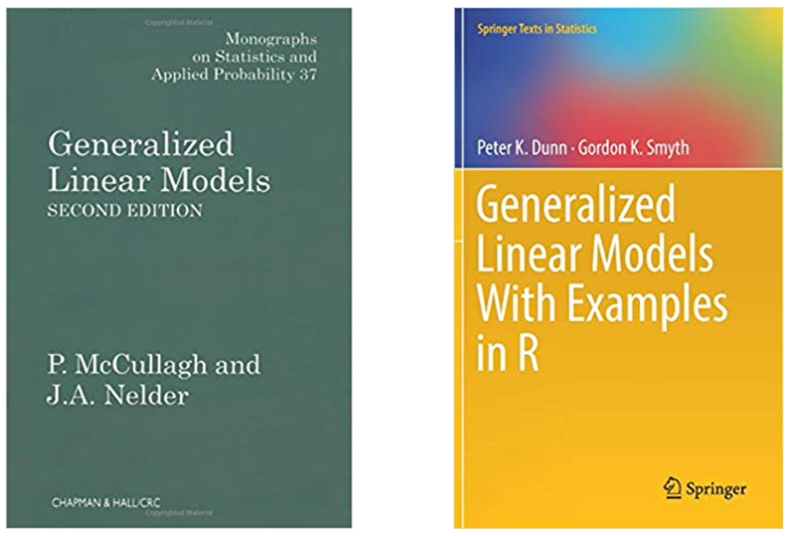
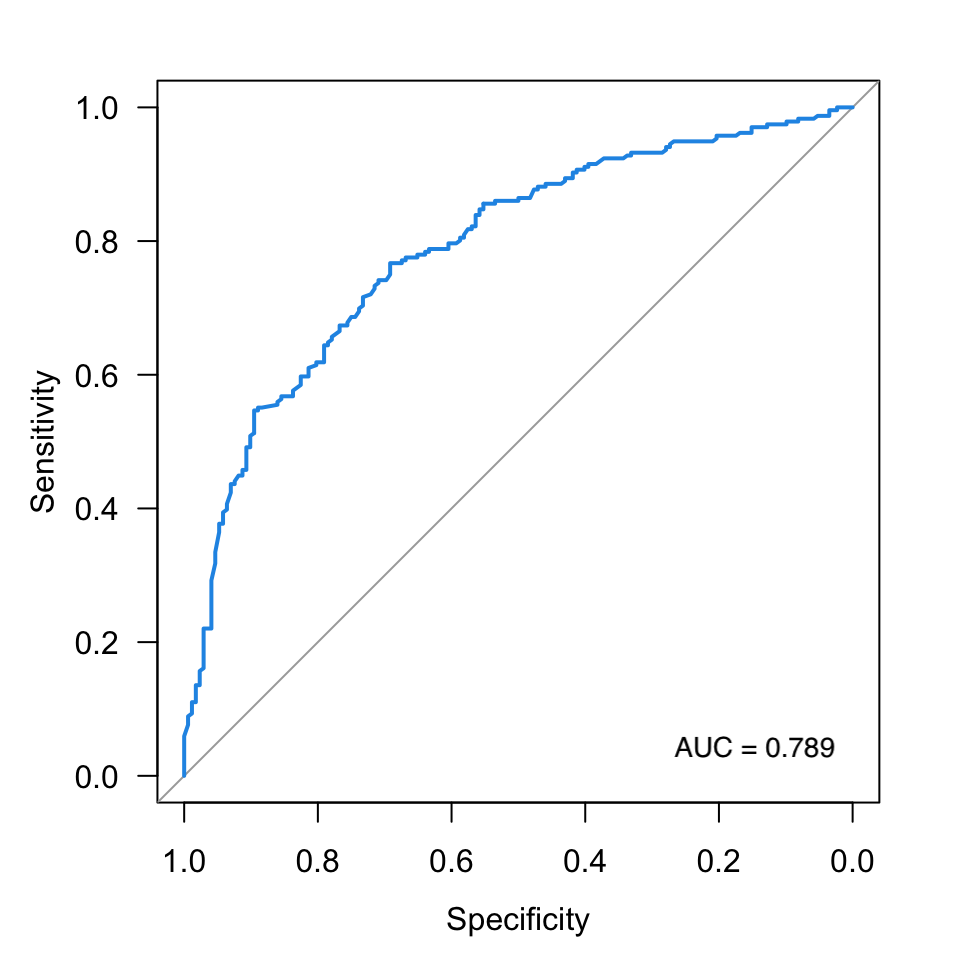

# Modelos de Regresión Avanzados{#glm}

Write an introductory paragraph to the Chapter.


## Regresión No Lineal

### Introducción

### Por qué?

### Ejemplo

### Modelo ajustado


### Inferencia 


### Medidas de desempeño


## Regresión Logística

El [_Modelo Lineal Generalizado_](https://es.wikipedia.org/wiki/Modelo_lineal_generalizado) (MLG) fue formulado por [John Nelder](https://en.wikipedia.org/wiki/John_Nelder) y Robert Wedderburn en 1972 como una familia de modelos de regresión en los que la _naturaleza_ de la variable respuesta _puede_ ser distinta a una distribución Normal. En la práctica, esto se refiere a que la variable respuesta $Y$ no necesariamente debe ser continua o simétrica. Sin embargo, el trabajo seminal de John Nelder y [Peter McCullagh](https://en.wikipedia.org/wiki/Peter_McCullagh) en 1983  (ver Figura \@ref(fig:nelder), izquierda) popularizó este modelo y los hizo merecedores de varios premios.


En términos generales,

* El MLG es un modelo flexible en el que una _función_ de la respuesta media está _relacionada_ con covariables a través de un predictor lineal.
*  En MLG, la variable respuesta $Y$ tiene una distribución de probabilidad que pertenece a la [familia exponencial de distribuciones](https://es.wikipedia.org/wiki/Familia_exponencial). A esta familia pertenecen las distribuciones Binomial, Poisson, Normal, Gamma y Beta, entre otras. 
*  Como consecuencia, el MLG se utiliza para describir variables respuesta que no necesariamente siguen una distribución Normal. 
* Cuando utilizamos el MLG _no_ es necesario transformar los datos ni validar supuestos de varianza _constante_.


<br>

```{r nelder, echo=FALSE, out.width="65%", fig.align='center', fig.cap="Textos clásicos sobre _Modelos Lineales Generalizados_."}

```

<br>

Dentro de los modelos de regresión que hacen parte del MLG y se utilizan ampliamente en la práctica se encuentran:

1. Regresión Lineal Simple y Múltiple
2. Regresión Logística
2. Regresión Poisson
3. Regresión Beta
4. Regresión Gamma

En este Capítulo no enfocaremos en la Regresión Logística y la Regresión Poisson. Para más detalles sobre RLS y RLM pueden consultarse los Capítulos \@ref(rls) y \@ref(rlm), respectivamente.


### Introducción

El modelo de Regresión Logística se ampliamente utilizado para relacionar una variable respuesta $Y$ del tipo éxito/fracaso, Si/No, Sirve/No sirve, Compra/No compra, Enfermo/No enfermo, con un conjunto de variables controlables $X_1, X_2,\ldots,X_k$, también conocidas como predictores. 

Algunas aplicaciones del modelo de Regresión Logística incluyen

* Marketing
* Ingeniería
* Medicina
* Bioligía
* Transporte
* Diseño de productos
* Preferencias 


Debido  _naturaleza_ binaria de la variable respuesta $Y$, los modelos de RLS o RLM no constituyen una alternativa realista. Haciendo uso del MLG podemos, utilizar la distribución Bernoulli con parámetro  parámetro $0<\theta<1$ como modelo probabilístico para describir la ocurrencia de un evento de interés. En esta formulación, $\theta$ representa $P(\text{ocurra el evento})$

Por ejemplo, si estuviésemos interesados en el comportamiento de pago de una obligación financiera y consultamos el historial de un hombre de 29 años con título universitario, casado, con 2 hijos y que paga arriendo, la variable repuesta podría definirse como:


$$
Y = \begin{cases}
1\quad \text{  si la persona cumple con su obligación}\\
0\quad \text{  en otro caso}
\end{cases}
$$
y las variables predictoras o controlables como

\begin{align}
x_1&:  \text{ edad en años,} \\
x_2&:  \text{ sexo,}    \\ 
x_3&:  \text{ estado civil,}  \\
x_4&: \text{ número de hijos,} \\
x_5&: \text{ tipo de vivienda.}
\end{align}

Si esta persona cumple con sus obligación financiera, la _fila_ correspondiente en una base de datos tendría la siguiente estructura:


```{r eval=TRUE, echo=FALSE}
x <- c(5, 1, 29, 'hombre', 'casado', 2, 'arrendada')
names(x) <- c('id', 'y', 'x1', 'x2', 'x3', 'x4', 'x5')
x <- data.frame(t(x))
```

```{r echo=FALSE}
x
```


### Formulación del modelo

Puesto que $Y$ es una variable binaria, en el modelo de Regresión Logística se utiliza la distribución Bernoulli como un modelo probabilístico. En general, decimos que

$$Y\sim\text{Bernoulli}(\theta), \quad 0<\theta<1$$
donde $\theta = P(Y=1)$. Es fácil mostrar que, en la distribución Bernoulli con parámetro $\theta$,

$$
\begin{align}
E[Y] &= \theta \\
\text{Var}[Y] &= \theta(1-\theta).
\end{align}
$$

En el ejemplo de la entidad financiera, diríamos que $\theta$ es la probabilidad de que la persona _cumpla_ con su obligación.

En Regresión Logística, el **objetivo** es _relacionar_ una función del valor esperado de $Y$ con las variables controlables $x_1,x_2,\ldots,x_k$. La función que utilizamos es la función _logit_ definida como

$$
\text{logit}(\theta) = \log\left(\frac{\theta}{1-\theta} \right)
$$
donde, como se mencionó anteriormente,  $\theta = E[Y]$.

Por lo tanto,

$$
\text{logit}(\theta) = \log\,\left(\frac{\theta}{1-\theta}\right ) = \beta_0 + \beta_1x_1 +\beta_2x_2+\cdots+\beta_k x_k + \epsilon
$$

con $\epsilon$ el error aleatorio. 

A partir de una muestra de tamaño $n$, podemos estimar el modelo de Regresión Logística como


$$
\log\,\left(\frac{\hat{\theta}}{1-\hat{\theta}}\right )=\hat{\beta}_0 + \hat{\beta}_1x_1+\hat{\beta}_2x_2+\cdots+\hat{\beta}_kx_k.
$$

Note que en esta formulación, $\hat{\beta}_1$ representa el cambio esperado en $\text{logit}(\hat{\theta})$ por cada cambio unitario en $x_1$ cuando $x_2, x_3,\ldots,x_k$ se mantienen _constantes_.

Aunque saber $\text{logit}(\theta)$ es importante, su interpretación puede confusa. A partir de la expresión anterior, es fácil llegar a que

$$
\hat{\theta} =\frac{1}{1+e^{-\hat{\beta}_0 - \hat{\beta}_1x_1-\hat{\beta}_2x_2-\cdots-\hat{\beta}_kx_k}}\cdot
$$

Observe que, en esta expresión, $\hat{\theta} = f(x_1, x_2,\ldots,x_k)$, es decir, $\hat{\theta}$ _depende_ de las variables controlables a través de los coeficientes 
$(\hat{\beta}_0, \hat{\beta}_1, \hat{\beta}_2, \ldots, \hat{\beta}_k)$, también conocidos como los parámetros estimados del modelo. Sin embargo, la _interpretación_ de estos coeficientes bajo esta formulación **no** corresponde a la que discutió previamente. 

En la práctica, conocer la función que relaciona a $\hat{\theta}$ con las variables controlables es fundamental. Por ejemplo, a través de dicha función y conociendo los valores de $x_1, x_2,\ldots,x_k$, es posible predecir, en una entidad financiera, la probabilidad de un cliente potencial _cumpla_ con su obligación antes de que esta sea otorgada.


### Ejemplo

Consideraremos un proceso de producción en el que se fabrican 500 unidades de producto, cada una de ellas en condiciones de operación diferentes.  Para cada unidad, de registró la variable respuesta
$$Y=\begin{cases}
1 \quad\text{ si cumple con la especificación} \\
0 \quad\text{ en otro caso.}  
\end{cases}
$$ 
además de la variable $x_1$ que corresponde a la _apertura_ de una válvula. Así por ejemplo, $x_1<0$ indica que la válvula se cerró; $x_1=0$ corresponde a las condiciones _actuales_; y $x_1>0$ indica que la válvula se abrió.

Las primeras 6 filas de los datos se presentan a continuación:


```{r}
## lectura de datos
d <- read.delim2("https://www.dropbox.com/s/94fyp9sefi1ml3a/logistic2.txt?dl=1", header = TRUE)
d$x1 <- as.numeric(as.character(d$x1))   ## cambiar z a numérico
head(d)
```

Al analizar la proporción de productos conformes y no conformes se tiene que:

```{r}
## proporción de 1's y 0's 
prop.table(with(d, table(y)))
```

Por lo tanto, sóo el 32% de las unidades producidas durante la toma de la muestra _cumple_ con las especificaciones. 

Veámos qué ocurre con el evento de interés cuando cambiamos $x_1$: 

```{r, eval=TRUE, tidy=TRUE, size = 'normalsize', cache=FALSE, message=FALSE, fig.width = 8, fig.height = 4}
## boxplot
par(mfrow  = c(1,2))
with(d, boxplot(x1 ~ y, las = 1, col = c("salmon", "lightblue"), xlab = 'Unidad conforme?', 
                names = c("No", "Si"), ylab = "Cambio en la apertura"))

## grafico de dispersion
with(d, plot(x1, y, las = 1, ylab = 'Unidad conforme?', xlab = 'Cambio en la apertura'))
```

Otra posibilidad para estudiar la distribución de la apertura de válvula dependiendo de la característica final del producto consiste en usar un [`ridglineplot`](https://www.r-graph-gallery.com/294-basic-ridgeline-plot.html):

```{r, message=FALSE, fig.height=4, fig.width=7, fig.align='center'}
# dispnibilidad de pauuetes
library(ggridges)
library(ggplot2)
 
# gráfico
d2 <- d
d2$y <- ifelse(d2$y == 1, 'conforme', 'no conforme')
ggplot(d2, aes(x = x1, y = y, fill = y)) +
  geom_density_ridges() +
  theme_ridges() + 
  theme(legend.position = "none")
```


De acuerdo con estos resultados, podemos afirmar que el producto cumple con las especificaciones (i.e., $Y=1$) para valores de apertura de válcula tal que $x_1>0$. En particular, cuando $x_1\approx 2$, el producto es _conforme_. el reto es entonces encontrar la relación entre $\theta$ y $x_1$, además de un rango de valores de $x_1$ tal que $a<\hat{\theta}<b$.


#### Modelo ajustado{-}

El modelo de Regresión Logística puede ajustarse en `R` utilizando al función `glm` del paquete `base`:

```{r, eval=TRUE, tidy=TRUE, size = 'normalsize', cache=FALSE, message=FALSE}
## modelo ajustado
fit <- glm(y ~ x1, data = d, family = "binomial")
```

Observe que la sintaxis es similar a la que discutimos en los Capítulos \@ref(rls) y \@ref(rlm), pero en  lugar de usar `lm` usamos `glm`. Además, se tienen un argumento adicional: `family`.  Con este argumento especificamos la distribución de probabilidad que describe la _naturaleza_ de la variable respuesta. Como se mencionó con anterioridad, en Regresión Logística utilizamos la distribución Bernoulli como modelo probabilístico.  Como trabajamos con una muestra de tamaño $n$, especificamos `family = "binomial"`. Para mayor información, se recomienda consultar la sintaxis de la función [`glm`](https://www.rdocumentation.org/packages/stats/versions/3.6.2/topics/glm).

#### Inferencia {-}

En Regresión Logística pdoemos hacer inferencia para 

1. Los coeficientes del modelo; y 
2. la razón de _Odds_.

En nuestro ejemplo, los coeficientes estimados, además de otros indicadores, pueden obtersen haciendo:

```{r}
## resultados del modelo
summary(fit)
```


De acuerdo con estos resultados, el modelo estimado de Regresión Logística es


$$
\text{logit}(\hat{\theta}) = -0.03+1.124\,x_1
$$

Por lo tanto, al aumentar la apertura de válvula en una unidad, se espera que, en promedio, $\text{logit}(\hat{\theta})$ aumente 1.124 unidades. 


Para determinar si el coeficiente $\beta_1$ es estadísticamente significativo, es decir, si a nivel _poblacional_ la variable $x_1$ afecta de manera importante $\text{logit}(\theta)$, realizamos el siguiente procedimiento de prueba de hipótesis:

$$
\begin{align}
H_0&: \beta_1 = 0 \\
H_1&: \beta_1 \neq 0 
\end{align}
$$
para un nivel de significancia $\alpha\in(0,1)$.

Esta hipótesis de prueba de manera similar a como hicimos en el caso de RLS y RLM.  De la salida de `R` se tienen que el estadístico de prueba es $$t_1= \frac{\hat{\beta}_1}{\text{s.e.}(\hat{\beta}_1)} = \frac{1.124}{0.110} =  10.165.$$

Bajo $H_0$, $t_1 \sim t_{n-2}$. Como el valor $p$ es $<10^{-16}$, rechazamos $H_0$ y concluimos que, a nivel _poblacional_, la apertura de válvula $x_1$ influencia el $\text{logit}(\hat{\theta})$.

Otra forma de probar $H_0$ es construyendo intervalos de confianza del $(1-\alpha)$100% para $\beta_1$. Es fácil mostrar que dicho intervalo es de la forma

$$
(\hat{\beta}_1 - t_{1-\alpha/2, n-p}\, \text{s.e.}(\hat{\beta}_1), \hat{\beta}_1 + t_{1-\alpha/2, n-p}\, \text{s.e.}(\hat{\beta}_1))$$

donde $\text{s.e.}(\hat{\beta}_1) = \sqrt{\text{V}(\hat{\beta_1})}$.

En nuestro caso, $\hat{\beta}_1 = 1.124$, $\text{s.e.}(\hat{\beta}_1) = 0.11$ y $t_{1-\alpha/2, n-p} =t_{0.975, 498} = 1.965$. Por lo tanto,

$$
\beta_1 \in (0.908, 1.34)
$$

De manera similar, podemos construir intervalos de confianza del 95% para $\beta_1$ utilizando la función `confint.default` 


```{r}
## intervalos de confianza del 95%
confint.default(fit)
```

Por lo tanto, $\beta_1\in(0.908, 1.341)$ con una confianza del 95%.


#### Sobre la razón de _Odds_{-}

Es común que en Regresión Logística estemos interesados en el _efecto_ de $x_1$ sobre $\theta$, en lugar del efecto de dicha variable sobre $\text{logit}(\hat{\theta})$.

Recordemos que 

$$\text{logit}(\hat{\theta}) = \log\left(\frac{\hat{\theta}}{1-\hat{\theta}}\right) = -0.03+1.124\,x_1$$

Observe que en esta expresión, la cantidad


$$\frac{\hat{\theta}}{1-\hat{\theta}}$$

corresponde al cociente entre la probabilidad de que el producto **cumpla** con las especificaciones y la probabilidad de que el producto **no cumpla** con las especificaciones. Por tratarse de probabilidades, esta cantidad corresponde a una _razón_ de probabilidades o, simplemente, al [_Odds Ratio_](https://es.wikipedia.org/wiki/Raz%C3%B3n_de_momios) (OR).

En la práctica, el OR para la variable $x_j$ puede obtenerse fácilmente cómo

$$\text{OR}_j = e^{\hat{\beta}_j}$$

donde $\hat{\beta}_j$ es el coeficiente asociado a la variable controlable $x_j$ en el modelo de Regresión Logística.  En el caso del proceso de producción, se tiene que

$$
\widehat{\text{OR}}_1 = e^{1.124} = 3.08
$$
Por lo tanto, al aumentar la apertura de válvula en una unidad, es $\approx 3.1$ veces más probable que una unidad de producto fabricada bajo esas condiciones de operación cumpla con las especificaciones a que no lo haga. 


Realizar pruebas de hipótesis sobre los coeficientes del modelo de Regresión Logística es equivalente a probar 

$$
\begin{align}
H_0&: \text{OR} = 1 \\
H_1&: \text{OR} \neq 1
\end{align}
$$
debido a la relación uno a uno entre $\widehat{\text{OR}}_j$ y $\hat{\beta}_j$.  

En el caso del proceso de producción, podemos construir un intervalo de confianza para $\text{OR}_1$ aplicando la función exponencial a los límites del intervalo de confianza para $\beta_1$. Finalmente, un intervalo de confianza del 95% para  $\text{OR}_1$ estará dado por:

$$
\text{OR}_1 \in (e^{0.908}, e^{1.34}) \Rightarrow \text{OR}_1 \in  (2.479, 3.819).
$$ 


Finalmente, diremos que, a nivel _poblacional_ es entre $\sim 2.5$ y $\sim 3.8$ más probable que el producto fabricado cumpla con las especificaciones cuando la apertura de válvula _aumenta_ una unidad. En definitiva, debe abrirse la válvula.


### Evaluación del modelo 

Al igual que en RLS y RLM, en Regresión Logística es fundamental determinar si el modelo _ajusta_ bien a los datos. Para ello, existen las siguientes estrategias:

1. Realizar una prueba de significancia global.
2. Construir la curva ROC y determinar el área bajo la curva.
3. Utilizar la prueba de Hosmer-Lemeshow
4. Calcular una medida de ajuste simiarl al $R^2$ en RLS y RLM.

<br>

**Prueba de significancia global**

Esta prueba puede obtenerse haciendo:

```{r}
## prueba de significancia global
Deviance <- with(fit, null.deviance - deviance)
df <- with(fit, df.null - df.residual)
(p_value <- 1 - pchisq(Deviance, df))
```

En este caso, probamos la hipótesis nula de que el modelo que incluye la variable $x_1$ no es mejor que un modelo ajustado sólo con el intercepto, es decir, que el coeficiente $\beta_1 = 0$. Como el valor $p < 0.05$, rechazamos $H_0$ y concluimos que considerar la apertura de válvula $x_1$ es mejor que no incluirla. En otras palabras, concluimos que $x_1$ tiene un efecto importante sobre el si el producto es o no conforme.  


<br>

**Curva ROC**

La curva _Receiver Operating Characteristic_(ROC) o simplemente curva ROC, fue esarrollado en la $2^\text{a}$ guerra mundial. En la actualidd, se utiliza en diferentes áreas incluyendo medicina, biología, ingeniería, finanzas y genómica, entre otras, para  evaluar el desempeño de un clasificador binario _al cambiar_ un **punto de corte** o _cutoff_.

```{r roccurve-plot, echo=FALSE, out.width="60%", fig.align='center', fig.cap="Ejemplo de una curva ROC."}

```

A través de la curva ROC, es posible determinar si el modelo de Regresión Logística es **bueno** y así descartar aquellos modelos subóptimos. El gráfico representa la _sensibilidad_ $(S_e)$, es decir, _true positive rate_ o _recall_ vs. $1-\text{especificidad}$, también conocida como $S_p$ o _fall-out_. En la Figura \@ref(fig:roccurve-plot) se presenta un ejemplo.

La curva ROC se caracteriza a través del cálculo del área bajo la curva, también denominada AUC (por sus siglas en inglés). Observe que el área total de la Figura \@ref(fig:roccurve-plot) corresponde a un cuadrado de lado 1, por lo que $\text{AUC}_{\max} = 1$. Por definición, $0\leq\text{AUC}\leq 1$. En la práctica, modelos de Regresión Logística con un $\text{AUC} \geq 0.7$ son _aceptables_[@ROC]. Ahora, si se tienen varias curvas ROC en un sólo gráfico, el _mejor_ modelo de Regresión Logística será aquel cuya curva ROC sea lo más parecida posible a una `L` invertida.


Para construir la curva ROC en `R` utilizamos el paquete `pROC`\index{pROC} [@pROC] y procedemos de la siguiente manera: 

```{r, fig.width=5, fig.height=5, fig.align='center', message=FALSE, fig.cap="Curva ROC para el problema de la válvula."}
## cargamos el paquete pROC
require(pROC)

## curva ROC
theta_hat <- predict(fit, type = 'response')
ROC <- roc(y ~ theta_hat, data = d)
plot(ROC, las = 1, col = "purple")
```

Finalmente, el AUC puede obtenerse como

```{r}
## cálculo del AUC
ROC$auc 
```

**Conclusión**. Como $\text{AUC} = 0.840 > 0.7$, concluimos que nuestro modelo de Regresión Logística es bueno para diferenciar producto conforme de producto no conforme.


<br>

**Prueba de Hosmer-Lemeshow**

La prueba de Hosmer & Lemeshow está implementada en el paquete `ResourceSelection`\index{ResourceSelection}[@ResourceSelection]. La prueba contrasta el número de casos observados vs. el número de casos esperados para rangos específicos de probabilidad, siendo estos últomos calculados a partir del modelo de Regresión Logística estimado. Cuando las tasas de eventos esperados y observados son similares para un número de subgrupos $g > p+1$, decimos que el modelo de Regresión Logística está bien _calibrado_. En otras palabras, cuando _no_ rechazamos la prueba de Hosmer-Lemeshow para $g$ grupos, decimos que el modelo _ajusta_ bien a los datos.

En nuestro caso, $p=1$, por lo que $g>2$. A continuación se muestra cómo realizar la prueba de bondad de ajuste de Hosmer \& Lemeshow para $g=3$:

```{r, echo=TRUE, message=FALSE, fig.width=4, fig.height=4, fig.align='center'}
## paquete ResourceSelection
require(ResourceSelection)

## valor p de la prueba de Hosmer & Lemwshow
g <- length(coefficients(fit)) + 1
hl <- hoslem.test(fit$y, fitted(fit), g = g)
hl$p.value
```

Como el valor $p$ es $>0.05$, podemos decir que el modelo de Regresión Logística ajustado está bien calibrado. Para más detalles se recomienda consultar [este](https://thestatsgeek.com/2014/02/16/the-hosmer-lemeshow-goodness-of-fit-test-for-logistic-regression/) material.


<br>

**Cálculo del pseudo $R^2$** 

Así como en RLS y RLM, en el modelo de Regresión Logística es posible calcular _pseudo_ $R^2$. Aunque el $R^2_\text{pseudo} \in (0,1)$, la interpretación es levemente diferente. En particular,  valores de $R^2_{\text{McFadden}}$ entre 0.2 y 0.4 sugieren un excelente ajuste del modelo de Regresión Logística. Por otro lado, valores cercanos a 0 indican que el modelo no tiene ningún poder predictivo. Para más detalles, ver [esta](https://stats.stackexchange.com/questions/82105/mcfaddens-pseudo-r2-interpretation) discusión en `stackexchange`.


El $R^2_\text{pseudo}$ del modelo ajustado, el _pseudo_ $R^2$ puede obtenerse a través de la función `pR2` del paquete `pscl`\index{pscl}[@pscl]:

```{r, message=FALSE}
## paquete pscl
require(pscl)

## pseudo R^2
pR2(fit)
```

En este caso, el $R^2_{\text{McFadden}}$ es `r round(pR2(fit)[4], 3)`, por lo que concluimos que nuestro modelo ajusta bien a los datos y por tanto es _bueno_ para diferenciar producto conforme de producto no conforme.  


### Predicción 


## Regresión Poisson

### Introducción

La Regresión Poisson es útil cuando se tiene una variable aleatoria respuesta $Y$ que representa conteos por unidad de distancia, área, volúmen o tiempo, y es de interés predecir el **número esperado** de dichos conteos a partir de un conjunto de factores controlables independientes $X_1, X_2, \ldots, X_k$. 

La Regresión Poisson hace parte del Modelo Lineal Generalizado. Puesto que $Y$ representa conteos _independientes_, es natural pensar que la distribución Poisson sea un plausible modelo para describir el proceso que genera dichos conteos. Por lo tanto,

$$
Y \sim \text{Poisson}(\lambda), \quad \lambda > 0,
$$

donde $\lambda$ es el parámetro de la distribución Poisson. Además, $E[Y] = \text{Var}[Y] = \lambda$. Como se discutirá más adelante, esta es una propiedad fundamental de la distribución Poisson que tiene implicaciones  importantes en el modelo de Regresión Poisson.

Con frecuencia, este parámetro se interpreta, por ejemplo, como (1) el número _esperado_ de unidades defectuosas por hora; (2) el número _esperado_ de defectos por metro cuadrado de baldosa producido; o (3) el número esperado de productos defectuosos por unidad de empaque. Formalmente, $\lambda$ puede verse como la _tasa_ a la que ocurren los eventos de interés.

La función de masa de probabilidad de $Y$ está dada por:

$$
P(Y = y | \lambda) = \frac{e^{-\lambda}\lambda^y}{y!}, \quad y=0,1,\ldots
$$


### Por qué? 

El modelo de Regresión Poisson **aparece** como una alternativa para incluir información de los factores controlables del proceso en la estimación del parámetro $\lambda$ , a través de un predictor lineal.  Posteriormente, al tener condiciones definidas de operación, es decir,  valores específicos para las variables independientes, podremos calcular $\lambda$ como 

$$\hat{\lambda} = f(x_1, x_2, \ldots, x_k).$$

Formalmente, esto es

$$
\log\left(\lambda\right) = \beta_0 + \beta_1x_1 + \beta_2x_2 + \cdots \beta_kx_k + \epsilon
$$
donde $\mathbf{\beta} = (\beta_0, \beta_1, \ldots, \beta_k)$ son los coeficientes del modelo y $\epsilon$ es el error aleatorio.


A partir de esta expresión es fácil llegar a que

\begin{equation}
\hat\lambda = e^{\hat{\beta}_0 + \hat{\beta}_1x_1 + \hat{\beta}_2x_2 - \cdots +\hat{\beta}_kx_k}\cdot
\end{equation}

Así, $$Y \sim \text{Poisson}(\hat{\lambda})$$

 y

\begin{align}
P(Y = y | x_1, x_2, \ldots, x_k) &= P(Y|\hat{\lambda}) \\             
                  &= \frac{e^{-\hat{\lambda}}\hat{\lambda}^y}{y!}\cdot
\end{align}


Consideremos un proceso en el que se contabilizan el número de artículos defectuosos por cada unidad de empaque producida y supongamos que se controlan las variables $x_1$ y $x_2$. 

Si definimos

$$Y = \text{Número de artículos defectuosos por unidad de empaque},$$ 
entonces $Y\sim\text{Poisson}(\lambda)$, $\lambda>0$.

A partir de una muestra de tamaño $n$, es fácil llegar a que un estimador _insesgado_ de $\lambda$ es

$$\hat{\lambda} = \frac{1}{n}\sum_{i=1}^n y_i.$$

Sin embargo, observe que al emplear este estimador de $\lambda$, no tenemos en cuenta información adicional sobre dicho parámetro que las variables  $x_1$ y $x_2$ pudieran proporcionarnos. 


### Ejemplo 

Se tienen datos de un experimento en el que se empacaron 150 cajas de un producto particular. Cada caja tiene 50 unidades de producto. Una vez empacadas, a cada caja  se le realizó inspección 100% y se registró el número de artículos defectuosos, además de las condiciones de operación de la máquina (variables $x_1$ y $x_2$) y el tipo de máquina (variable $x_3$).

```{r datos, eval=TRUE, tidy=TRUE, size = 'normalsize', cache=FALSE, message=FALSE}
# lectura de datos 
url <- 'https://www.dropbox.com/s/xpxy928ugcxr3ck/machine.txt?dl=1'
d <- read.table(url, header = TRUE)

# primeras 4 filas de los datos
head(d, 4)
```

La distribución del número de artículos defectuosos por caja es:

```{r barplot, eval=TRUE, tidy=TRUE, size = 'normalsize', cache=FALSE, fig.align='center', message=FALSE, fig.width = 4.5, fig.height = 4.5,fig.cap="Número de artículos defectuosos por caja  en la muestra."}
## barplot
require(ggplot2)
#Freq <- with(d, table(y))
ggplot(d, aes(x = as.factor(y))) + geom_bar(fill = 'midnightblue') + 
  xlab('Número de artículos defectuosos por caja') +
  ylab("Frecuencia") +
  theme_minimal()
```

Puesto que trabajamos con conteos, una distribución de probabilidad posible que describe la variable $Y$ es $Y\sim \text{Poisson}(\lambda)$, $\lambda>0$. A partir de la muestra, se obtiene que 

$$\hat\lambda = \frac{1}{150}\sum_{i=1}^{150}y_i = `r round(mean(d$y), 3)`$$

Sin embargo, observe que la estimación de $\lambda$ no tiene en cuenta las condiciones de operación $(x_1, x_2)$ ni la máquina en la que se empaca el producto, lo cual sería deseable.  


### Modelo ajustado

Puesto que las condiciones de operación y la máquina en la que se empaca el producto podrían ser determinantes en el número de artículos defectuosos por caja que se obtienen, planteamos un modelo de Regresión Poisson. 

En `R` el modelo puede ajustarse como se muestra a continuación. Observe que utilizamos la función `glm` en lugar de `lm` y especificamos que la distribución que sigue la variable respuesta es una distribución Poisson al especificar `family  = poisson()`.


```{r modelopois, eval=TRUE, size = 'normalsize', cache=FALSE, message=FALSE}
## modelo de Regresión Poisson
## la funcion clave es glm --- para ayuda ver ?glm
## debemos seleccionar family = poisson()
fit <- glm(y ~ ., data = d, family = poisson())

# coeficientes estimados
summary(fit) 
```

De acuerdo con los resultados obtenidos, la ecuación del modelo ajustado es:

$$ 
\hat{\lambda} = e^{-0.628 + 0.946\,x_1 - 1.326\,x_2 - 0.887\, x_{3,\text{M2}}}
$$
donde $x_{3,\text{M2}}$ es una variable indicadora tal que $x_{3,\text{M2}} = 1$ si trabajamos en la máquina `M2` y $x_{3,\text{M2}} = 0$ si trabajamos en la máquina `M1`. Note que si concemos $x_1$, $x_2$ y la máquina en la que se empacará el producto, podemos calcular fácilmente el valor de $\hat{\lambda}$.

Si usáramos la máquina `M2` en lugar de la máquina `M1`, se esperarían, en promedio, $e^{-0.887} = 0.411$ unidades defectuosas menos por cada caja producida. En otras palabras, se esperan producir  $1/e^{-0.887} = 2.43$  unidades defectuosas menos por caja cuando utilizamos la máquina `M1` en lugar de la máquina `M2` al mantener $x_1$ y $x_2$ constantes. Si continuamos trabajando en la máquina `M2` y aumentamos $x_1$ en una unidad mientras mantenemos $x_2$ constante, se esperan obtener $e^{0.946} = 2.575$ unidades defectuosas más por cada caja de producto terminado. Por otro lado, si aumentamos $x_2$ en una unidad manteniendo $x_1$ constante mientras continuamos trabajando en la máquina `M2`, se esperarían obtener $1/e^{- 1.326} = 3.766$ unidades defectuosas menos. En conclusión, si queremos _mejorar_ sustancialmente el proceso, podríamos comenzar trabajando únicamente con la máquina `M2`, posteriromente aumentar $x_2$ y, de ser necesario, reducir $x_1$. 

Para determinar si el modelo ajustado es mejor que el modelo `y ~ 1`, usamos una prueba de razón de verosimilitud (LRT en inglés). Aunque esta prueba esta implementada en el paquete `base` de `R` a través de la función `anova`, el reporte de los resultados es más informativo cuando usamos la función `lrtest` del paquete `lmtest`:

```{r lrt, eval=TRUE, tidy=TRUE, size = 'normalsize', cache=FALSE, message=FALSE}
## verificar disponibilidad de lmtest
if(!require(lmtest)) install.packages('lmtest')
require(lmtest)

## comparación del modelos usando la LRT
## ajustamos un modelo simple
nullmodel <- glm(y ~ 1, data = d, family = poisson())

## LRT
lrtest(nullmodel, fit)
```

A partir de estos resultados se concluye que incluir las variables $x_1, x_2$ y $x_3$ en el modelo de Regresión Poisson es  significativamente mejor que un modelo con sólo intercepto (es decir, $\beta_1 = \beta_2 = \beta_3 = 0$) para explicar el número de artículos defectuosos por caja.  

Una forma de determinar que el modelo tiene **buen ajuste** es a través de la utilización del _Deviance_. Para más detalles, ver la sección [4.4.9](https://bookdown.org/roback/bookdown-BeyondMLR/ch-poissonreg.html#sec-PoisGOF) del texto _Beyond Multiple Linear Regression_. La idea fundamental consiste calcular el valor $p$ de la prueba de hipótesis

$$
\begin{align}
H_0&: \text{El modelo propuesto tiene bien ajuste.} \\
H_1&: \text{El modelo propuesto NO tiene bien ajuste.}
\end{align}
$$

En `R` este valor $p$ puede cacularse fácilmente como:

```{r}
## deviance test
with(fit, 1-pchisq(deviance, df.residual))
```

Como el valor $p$ es $>0.05$, decimos que nuestro modelo tiene _buen ajuste_.


#### Sobredispersión{-} 

El modelo de Regresión Poisson puede sufrir de [sobredispersión](https://en.wikipedia.org/wiki/Overdispersion). En la práctica, este concepto se refiere a que $\text{Var}[Y] > E[Y]$, cuando $Y\sim\text{Poisson}(\lambda)$. En otras palabras, la propiedad fundamental de la distribución no se cumple. 

A partir del modelo ajustado, el parámetro de sobredispersión puede calcularse como:

$$
\hat{\phi} = \frac{1}{n-p}\sum_{i=1}^n\hat{\rho}_i
$$
donde $p = k+1$ y 

$$
\hat{\rho}_i = \frac{Y_i-\hat{\lambda}_i}{\sqrt{\hat{\lambda}_i}}
$$
es el residual de Person para la $i-ésima$ observación. 

En `R`, los residuales de Pearson se obtienen con la función

```{r, eval=FALSE}
## residuales de Pearson
residuals(fit, type = "pearson")
```

donde `fit` es el objeto que contiene el modelo de Regresión Poisson ajustado.

<!-- \begin{align} -->
<!-- \hat\lambda&=`r round(mean(d$y), 3)` \\ -->
<!-- \widehat{\text{Var}[Y]} &= s^2 =`r round(var(d$y), 3)`  -->
<!-- \end{align} -->

<!-- Por lo tanto, $$\hat{\phi} = \frac{\widehat{\text{Var}[Y]}}{\widehat{E[Y]}} > 1,$$ -->

<!-- por lo que es posible que exista sobredispersión. -->

Si sospechamos la existencia de sobredispersión en los datos, es recomendable estimar un modelo de Regresión Poisson con `family = quasipoisson`:

```{r}
## ajuste del modelo con family = quasipoisson
fitq <- glm(y ~ ., data = d, family = quasipoisson)

## ahora estimamos la dispersión
summary(fitq)
```

El parámetro de sobredispersión $\hat{\phi}$ puede obtenerse a partir del objeto `fitq` haciendo 


```{r, eval=FALSE}
## cálculo de phi
summary(fitq)$dispersion
```

De nuestros resultados, se tiene que $\hat{\phi} = `r round(summary(fitq)$dispersion, 3)`$, lo cual indica que los datos parecen no estar sobredispersos. 

Como complemento, podemos hacer una prueba formal del tipo

$$
\begin{align}
H_0: \phi = 1 \\
H_1: \phi > 1
\end{align}
$$

con la función `dispersiontest` del paquete `AER`:

```{r, message=FALSE}
## cargamos el paquete AER
require(AER)

## prueba para el coeficiente de dispersión
dispersiontest(fit, trafo = 1)
```

Puesto que el valor $p$ de la prueba es $0.8181 > 0.05$, concluimos que **no hay evidencia** de sobredispersión. 

Cuando hay sobredispersión, una alternativa al modelo de Regresión Poisson es una [Regresión Binomial Negativa](https://bookdown.org/roback/bookdown-BeyondMLR/ch-poissonreg.html#negative-binomial-modeling). Este modelo puede ajustarse en `R` con la función ``glm.nb` del paquete `MASS`. 


#### Exceso de ceros{-}

Los datos provenientes de procesos de conteo podrían sufrir de [exceso de ceros](https://stats.idre.ucla.edu/stata/dae/zero-inflated-poisson-regression/). Esto se refiere, fundamentalmente, a que el número de ceros en los datos es mayor al que esperaríamos si estos provinieran, realmente, de una distribución Poisson. 

Si $Y\sim \text{Poisson}(\lambda)$ y tuviéramos una muestra de tamaño $n$, el número esperado de ceros sería 

$$
n_0 = n\,P(Y=0|\lambda) = n\,e^{-\lambda}
$$

Si en la muestra observamos que el número de ceros es $n^\prime>>>n_0$, entonces los datos están _inflados_ con ceros. Por lo tanto, un modelo del tipo [Zero-inflated Poisson Regression](https://stats.idre.ucla.edu/r/dae/zip/) sería más apropiado.

En nuestro caso, el número de ceros en la muestra es

```{r}
## número de ceros
with(d, sum(y == 0))
```

Bajo el modelo Poisson, se esperan

```{r}
## número esperado de ceros
mean(d$y)*NROW(d)
```

Una prueba para igualdad de proporciones resulta en que:

```{r}
## prueba de proporciones para el número de ceros
prop.test(x = c(93, 135), n = c(150, 150), 
          alternative  = 'two.sided')
```

Al comparar la proporciones observadas y espereadas de ceros, observamos que hay _subdispersión_.


### Inferencia para $\lambda$

Recordemos $\hat{\lambda}$ es el número _esperado_ de artículos  defectuosos por caja cuando se conocen las variables $x_1,x_2$ y $x_3$. En otras palabras, $\hat{\lambda} = f(x_1, x_2, x_3)$.

A partir del modelo ajustado, la _tasa_ de artículos defectuosos por caja puede obtenerse como:

```{r thetahat, eval=TRUE, tidy=TRUE, size = 'normalsize', cache=FALSE, message=FALSE}
## cálculo de lambdahat 
lambdahat <- predict(fit, type = 'response')

## ahora incluyamos lambdahat para los 5 primeros individuos
d <- data.frame(id = 1:NROW(d), d, lambdahat)
head(d, 5)
```

Si las condiciones fueran $(2, -1)$ y se usara la máquina es `M1`, se tendría que:

```{r prediccion, eval=TRUE, tidy=FALSE, size = 'normalsize', cache=FALSE, message=FALSE}
# que pasa para las condiciones (2, -1) y máquina M1?
predict(fit, 
        newdata = data.frame(x1 = 2, x2 = -1, x3 = 'M1'), 
        type = 'response', se.fit = TRUE)
```

Por lo tanto, la _tasa_ de artículos defectuosos por caja cuando  $x_1=2$, $x_2=-1$ y $x3=\text{M1}$ será $\hat{\lambda}|_{x_1, x_2, x_3} = 13.325$ con  $\text{s.e.}(\hat{\lambda} = 2.709$. 

Un intervalo de confianza del 95% para $\lambda|_{x_1, x_2, x_3}$  está dado por

$$
13.325 \pm 1.96\times2.709 = (8.015, 18.635) 
$$

Esto implica que si trabajamos con estas condiciones de operación, se _espera_ que el  número _promedio_ de artículos defectuosos por caja a nivel poblacional esté en el intervalo $(8.015, 18.635)$ con una confianza del 95%.


### Estimación del número de errores

Anteriormente encontramos que se esperan, en promedio,  $\hat{\lambda}|_{x_1, x_2, x_3} = 13.325$  artículos defectuosos por caja. Utilizando _simulación_, es fácil determinar la distribución del número de artículos defectuosos que se obtendrían en 1000 cajas producidas bajo estas condiciones. A partir de estos resultados podemos entonces calcular un intervalo de confianza del 95\% para $Y_0$, no para $\lambda$.

```{r numeroderrores, eval=TRUE, tidy=FALSE, size = 'normalsize', cache=FALSE, message=FALSE}
## número de articulos defectuosos en 1000 cajas
## cuando x1 = 2, x2 = -1 y x3 = 'M1'
## lambda
lambda_est <- predict(fit, 
                      newdata = data.frame(x1 = 2, x2 = -1, x3 = 'M1'), 
                      type = 'response')

## semilla aleatoria
set.seed(123)

## número de cajas a empacar
N <- 1000

## número de artículos defectuosos en cada caja
yhat <- rpois(N, lambda_est)

## intervalo de confianza del 95% para Y_0
(ci <- quantile(yhat, probs = c(0.025, 0.975)))
```

Si trabajamos bajo estas condiciones de operación,  el número de artículos defectuosos _esperado_ en la _próxima_ caja estará entre 7 y 21, con una confianza del 95\%.  Gráficamente tendríamos:

```{r barplotnumeroderrores, eval=TRUE, tidy=TRUE, size = 'normalsize', cache=FALSE, message=FALSE, fig.width = 5, fig.height = 5, fig.align='center', fig.cap="Número de artículos defectuosos _esperado_ en la próxima caja."}
## barplot para el Y_0 cuando (2, -1, 'M1')
pred <- data.frame(yhat)
ggplot(pred, aes(x = yhat)) + geom_bar(fill = "midnightblue") +   xlab("Número de artículos defectuosos en la próxima caja") +
  ylab("Frecuencia") +
  geom_vline(xintercept = ci, color = "green") +
  geom_vline(xintercept = lambda_est, color = "red") +
  theme_minimal() 
```


### Cálculo de probabilidades

A partir del modelo ajustado es posible calcular probabilidades teniendo en cuenta las condiciones $(x_1, x_2)$ y la máquina $x_3$.  Por ejemplo la probabilidad de que se encuentren _exactamente_ 3 artículos defectuosos en una caja como función de $(x_1, x_2, x_3)$ puede expresarse como:


$$
P(Y = 3 | x_1, x_2, x_3) = \frac{e^{-\hat\lambda}{\hat\lambda}^3}{3!}
$$

donde 

$$
\hat\lambda = e^{-0.628  + 0.946x_1 - 1.326x_2   -0.887x_{3,\text{M2}}}
$$

Para las dondiciones $(2, -1, \texttt{M1})$ se tiene que $\hat\lambda = 13.325$. Así,

$$
P(Y = 3 | 2, -1, \texttt{M1}) = \frac{e^{-13.325}{13.325}^3}{3!} \approx 0.
$$


### Variaciones
El modelo de Regresión Poisson tiene algunas variaciones. Para mayor información, se sugiere consultar la documentación del paquete `pscl`\index{pscl}[@pscl].

